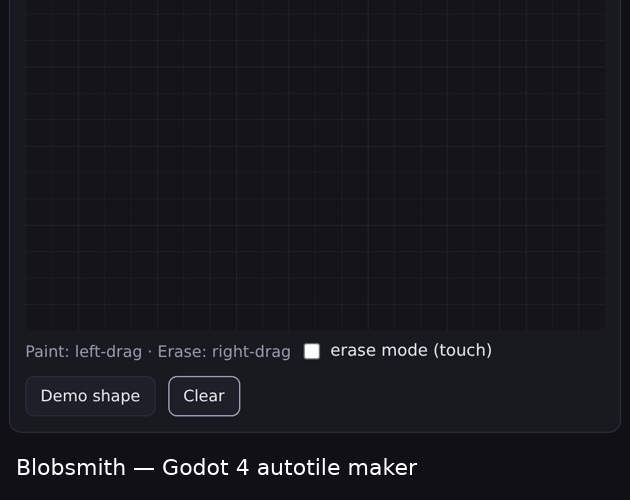

# Blobsmith Autotile Wirer

A Godot 4 editor plugin that turns a flat autotile sheet (PNG) into a fully wired `TileSet` resource: a terrain set, the correct terrain peering bits on every tile, and optional collision — in one click or one GDScript call.


Wiring a blob autotile in Godot by hand means clicking the peering bits for 47 tiles, one neighbor at a time, without getting a single mask wrong. This plugin does the whole pass from the tile's position in the sheet: it knows which of the 47 canonical blob masks each cell represents, and sets the matching terrain bits, terrain mode and collisions automatically.



*Above: the separate [Blobsmith](https://blobsmith.itch.io/blobsmith) pixel-art tool used to paint a 47-blob source sheet. This plugin is the next step — it takes such a sheet and wires it into a Godot 4 TileSet.*

## Features

- **One-click wiring** — pick a sheet, press *Generate TileSet*, get a wired `<sheet>_tileset.tres` saved next to the PNG.
- **Two layouts** — 47-blob (corners + sides, 8×6 tiles) or 16-tile (sides only, 8×2 tiles).
- **Automatic layout detection** — the file browser reads the PNG dimensions and pre-fills tile size and mode; a mismatch is reported instead of guessed.
- **Correct terrain mode per layout** — `MATCH_CORNERS_AND_SIDES` for 47-blob, `MATCH_SIDES` for 16-tile.
- **Per-tile peering bits** — derived from each tile's canonical neighbor mask, so painting resolves cleanly.
- **Optional collision** — full-square collision polygons on physics layer 0 (collision layer/mask 1).
- **Named terrain** — one terrain with a configurable name and a preset color.
- **Scriptable core** — `BlobsmithWirerCore` is a plain `RefCounted` with no editor dependency; call it from your own tooling or tests.
- **Headless verification script** — builds, saves, reloads and actually terrain-paints a `TileMapLayer` to prove the output works.

Everything above is implemented in this repository; nothing here is aspirational.

## Neighbor bit layout

Masks use a clockwise 8-neighbor encoding (bit → neighbor):

```
NW   N  NE        128   1   2
 W   ·   E   →      64   ·   4
SW   S  SE         32  16   8
```

A **corner** bit only counts when both of its adjacent side bits are present — a lone diagonal neighbor does not create a distinct tile. Collapsing every 8-bit combination to that rule yields exactly 47 canonical masks, which is why the blob layout has 47 tiles. `blob47()` returns those masks in ascending order; tile *i* in the sheet is expected at column `i % 8`, row `i / 8`.

## Stack

| Piece | Detail |
|-------|--------|
| Language | GDScript (`@tool`) |
| Engine | Godot 4.2+ (uses the static `EditorInterface` API) |
| Plugin entry | `EditorPlugin` registered via `plugin.cfg` v1.0.0 |
| Output | `TileSet` `.tres` (`ResourceSaver`) |
| Verification | Headless `SceneTree` script (uses `TileMapLayer`, so Godot 4.3+) |

## Architecture

```
                 PNG sheet (res://…/sheet.png)
                          │
         plugin.gd  ──────┤  EditorPlugin
         (Tools-menu dialog: browse, tile size,
          mode, terrain name, collision)
                          │  wire_and_save(...)
                          ▼
         wirer_core.gd  ── BlobsmithWirerCore  (RefCounted, no UI)
            detect_layout(w,h)  → { tile_size, sides_only }
            blob47() / blob16() → canonical masks, ascending
            build_tileset(...)  → TileSet + TileSetAtlasSource
                                   • add_terrain_set + mode
                                   • per-tile set_terrain_peering_bit
                                   • optional collision polygons
                          │  ResourceSaver.save
                          ▼
              <sheet>_tileset.tres  (next to the PNG)
```

The UI (`plugin.gd`) only collects parameters and reports status. All of the mask math and `TileSet` construction lives in `wirer_core.gd`, which has no reference to the editor and is exercised directly by the verification script.

## Getting started

### Prerequisites

- Godot **4.2 or newer** (the bundled verification script uses `TileMapLayer`, which needs **4.3+**).
- An autotile sheet in the expected layout: 8 columns, tiles in ascending canonical-mask order — a **47-blob** sheet (8×6 tiles) or a **16-tile** sheet (8×2 tiles). The sheet under `examples/` is one such sheet.

### Install

Copy the addon folder into your Godot project, then enable it:

```bash
# from your Godot project root
cp -r /path/to/blobsmith-autotile-wirer/addons/blobsmith_wirer addons/
```

Then in the editor: **Project → Project Settings → Plugins →** enable *Blobsmith Autotile Wirer*.

### Use it (editor)

1. **Project → Tools → "Blobsmith Autotile Wirer…"**
2. Browse to your `.png` sheet (tile size and mode auto-fill on selection).
3. Set the terrain name and whether to add collision.
4. Press **Generate TileSet**. A wired `<sheet>_tileset.tres` appears next to the PNG.
5. Add a `TileMapLayer`, assign the generated `TileSet`, and paint in its **Terrains** tab.

### Use it (script)

```gdscript
# false = 47-blob (corners+sides), true = 16-tile (sides only)
var out := BlobsmithWirerCore.wire_and_save(
    "res://tiles/grass_47blob_16px.png",  # sheet path
    16,       # tile size in px
    false,    # sides_only
    true,     # add full-square collision
    "Grass",  # terrain name
)
# out == "res://tiles/grass_47blob_16px_tileset.tres"  ("" on failure)
```

`build_tileset()` returns the `TileSet` in memory if you want to configure it further before saving.

### Verify

The verification script (`test_verify_addon.gd`) is a headless `SceneTree` program. It hardcodes the sheet at `res://tiles/grass_47blob_16px.png` and the addon at `res://addons/blobsmith_wirer/`, so run it from a Godot project laid out that way:

```bash
# inside a project containing:
#   res://addons/blobsmith_wirer/         (the addon)
#   res://tiles/grass_47blob_16px.png     (copy from examples/)
godot --headless --script res://test_verify_addon.gd
# prints PASS/FAIL per check, then "ADDON VERIFY: ALL PASS"; exit code 0 on success
```

It checks the mask tables, layout detection, a full build from the sample sheet, a save/reload round-trip, an actual terrain paint on a `TileMapLayer`, and the 16-tile mode.

## Project structure

```
blobsmith-autotile-wirer/
├── addons/
│   └── blobsmith_wirer/
│       ├── plugin.cfg          # plugin manifest (name, version 1.0.0, entry script)
│       ├── plugin.gd           # EditorPlugin: Tools-menu item + generator dialog
│       └── wirer_core.gd       # BlobsmithWirerCore: mask math + TileSet builder (no UI)
├── examples/
│   ├── grass_47blob_16px.png   # 128×96 sample sheet — 16px tiles, 47-blob layout
│   └── blobsmith-demo.gif      # the companion Blobsmith tool painting a sheet
├── test_verify_addon.gd        # headless SceneTree verification script
└── icon.png                    # 256×256 project icon
```

## Status and limitations

- **Personal project, tagged 1.0.0.** The core is covered by the verification script above; there is no CI running it for you.
- **The sheet must already be in the expected order.** The plugin wires masks by tile position; it does not reorder or validate the pixels of an arbitrary sheet. Feed it a sheet whose tiles are laid out in ascending canonical-mask order.
- **Layouts:** only the 47-blob and 16-tile arrangements are supported. Other autotile schemes are out of scope.
- **Collision** is a single full-square polygon per tile — enough for solid terrain, not per-shape edge collision.
- **Single terrain, single terrain set.** One terrain is created per run.
- **The verification script's paths are hardcoded** to `res://tiles/…`; adjust them or place the sample sheet accordingly before running.

The `examples/` sheet is produced by [Blobsmith](https://blobsmith.itch.io/blobsmith), a separate pixel-art tool that draws a 47-blob sheet from 6 base tiles. This plugin works with any sheet in the same layout.

## License

Released under the MIT License.
