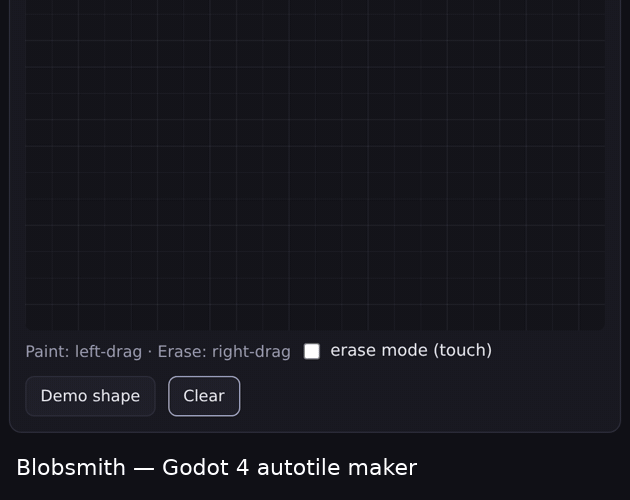

# Blobsmith Autotile Wirer

A Godot 4 editor plugin that turns a flat autotile sheet (PNG) into a fully wired `TileSet` resource: a terrain set, the correct terrain peering bits on every tile, and optional collision — in one click or one GDScript call.


Wiring a blob autotile in Godot by hand means clicking the peering bits for 47 tiles, one neighbor at a time, without getting a single mask wrong. This plugin does the whole pass from the tile's position in the sheet: it knows which of the 47 canonical blob masks each cell represents, and sets the matching terrain bits, terrain mode and collisions automatically.



*Above: the separate [Blobsmith](https://blobsmith.itch.io/blobsmith) pixel-art tool used to paint a 47-blob source sheet. This plugin is the next step — it takes such a sheet and wires it into a Godot 4 TileSet.*

## Free tileset pack — no install, no account, MIT

**[⬇ Download the 47-blob starter pack (8 wired TileSets, 154 KB)](https://github.com/leobaray/blobsmith-autotile-wirer/releases/download/starter-pack-v1/godot-47blob-starter-pack.zip)** · [release notes](https://github.com/leobaray/blobsmith-autotile-wirer/releases/tag/starter-pack-v1) · [browse the files](examples/starter-pack/)

Four terrains — **grass, stone, sand, water** — each at **16px and 32px**, each
shipped as a `.png` sheet plus an already-wired `.tres`. You do not need this
plugin, or any plugin, to use them: drop both files of a pair into your project,
add a `TileMapLayer`, set its `TileSet`, and paint in the Terrains tab.

| | 16px | 32px |
|---|---|---|
| Grass | `grass_47blob_16px` | `grass_47blob_32px` |
| Stone | `stone_47blob_16px` | `stone_47blob_32px` |
| Sand | `sand_47blob_16px` | `sand_47blob_32px` |
| Water | `water_47blob_16px` | `water_47blob_32px` |

All 47 tiles carry their terrain peering bits and a collision polygon; terrain
mode is Match Corners and Sides. Each of the eight was loaded headless in
**Godot 4.3, 4.4 and 4.7 stable**, painted with `set_cells_terrain_connect` and
read back — **104 checks, 104 passing on each of the three**
(`verify_starter_pack.gd`). It is procedural
placeholder art, not a hand-drawn asset pack: use it to prototype, to learn how
Godot terrains behave, and as a known-correct reference when your own sheet
paints the wrong tile. Details and per-file checks: [`examples/starter-pack/README.md`](examples/starter-pack/README.md).

## Features

- **One-click wiring** — pick a sheet, press *Generate TileSet*, get a wired `<sheet>_tileset.tres` saved next to the PNG.
- **Two layouts** — 47-blob (corners + sides, 8×6 tiles) or 16-tile (sides only, 8×2 tiles).
- **Automatic layout detection** — the file browser reads the PNG dimensions and pre-fills tile size and mode; a mismatch is reported instead of guessed.
- **Correct terrain mode per layout** — `MATCH_CORNERS_AND_SIDES` for 47-blob, `MATCH_SIDES` for 16-tile.
- **Per-tile peering bits** — derived from each tile's canonical neighbor mask, so painting resolves cleanly.
- **Optional collision** — full-square collision polygons on physics layer 0 (collision layer/mask 1).
- **Named terrain** — one terrain with a configurable name and a preset color.
- **Scriptable core** — `BlobsmithWirerCore` is a plain `RefCounted` with no editor dependency; call it from your own tooling or tests.
- **Headless verification script** — builds, saves, reloads and actually terrain-paints a `TileMapLayer` to prove the output works.

Everything above is implemented in this repository; nothing here is aspirational.

## Neighbor bit layout

Masks use a clockwise 8-neighbor encoding (bit → neighbor):

```
NW   N  NE        128   1   2
 W   ·   E   →      64   ·   4
SW   S  SE         32  16   8
```

A **corner** bit only counts when both of its adjacent side bits are present — a lone diagonal neighbor does not create a distinct tile. Collapsing every 8-bit combination to that rule yields exactly 47 canonical masks, which is why the blob layout has 47 tiles. `blob47()` returns those masks in ascending order; tile *i* in the sheet is expected at column `i % 8`, row `i / 8`.

> That rule is a claim about what the engine does, so it was asked: a headless
> script paints all 256 neighborhoods with `set_cells_terrain_connect()` and
> reads the peering bits back off the tile Godot 4.7 *chose* — 256/256 agree,
> and the engine distinguishes exactly 47 tiles. Toggle the eight neighbors and
> see which of the 47 answers your case (and how many of the 256 share it) at
> **<https://blobsmith.lbwma.com/godot-autotile-47-tiles/>**. The same page
> takes a `TileSet` `.tres` and lists the neighborhoods your set *cannot*
> answer — measured, a missing tile produces no error and no empty cell: the
> engine silently substitutes a tile claiming a corner the area does not have.

> **[Why a blob autotile has 47 tiles and not 256](docs/why-47-tiles-not-256.md)**
> is the long form of the paragraph above: the collapse rule and why it is about
> what the tile can *draw*, the closed-form count (a tile answers
> `2^(4 - adjacent side pairs)` neighborhoods, which is why the totals are
> 7×16 + 8×8 + 16×4 + 16×1 = 256), the engine transcript, the silent-substitution
> experiment, why a sides-only terrain set is 16 tiles instead, and the full
> 256 → 47 table with each tile's cell in the sheet.
> [`docs/verify_blob47.gd`](docs/verify_blob47.gd) is the sweep itself and takes
> **your** tileset — `godot --headless --script docs/verify_blob47.gd -- res://your.tres`
> prints every neighborhood your set cannot answer and the tile the engine
> substitutes for it.

> **[Terrain painting put the wrong tile down — what the engine actually does](docs/why-terrain-paints-the-wrong-tile.md)**
> settles the two answers search gives you, neither of which is measured. It is
> **not** random (same paint 30× → one tile, including the ambiguous cases), and
> it picks the tile that **disagrees with the fewest peering bits** among tiles
> belonging to the terrain you are painting — never leaving the cell empty and
> never borrowing from another terrain, which is exactly why you get an ugly
> tile instead of an error. Delete the fully-surrounded tile and the engine
> silently places the one that is a single corner bit off. Also: why the empty
> cells around your painted region are constraints, why `ignore_empty_terrains`
> is not the lever people think it is (a measured negative, stated as such), and
> how the terrain *mode* caps 47 tiles down to 16 without telling you.
> The score says how *wrong* the substitute is and never *which tile* you get:
> over all 47 holes the engine always lands on a minimum-mismatch tile, and not
> once is one tile alone at that minimum — between 3 and 8 tie every time.
> [`docs/verify_terrain_choice.gd`](docs/verify_terrain_choice.gd) asserts all
> 24 claims against your Godot build, and
> [`docs/predict_terrain_paint.js`](docs/predict_terrain_paint.js) predicts a
> painted region from your `.tres` alone, no engine — exiting non-zero on the
> first cell your set cannot answer. The same logic runs, byte for byte, at
> **<https://blobsmith.lbwma.com/godot-terrain-wrong-tile/>**, where you paint a
> region in the page and it names the cells with no exact tile.

> **[Thin lines between tiles — what actually causes them](docs/why-tiles-have-seams.md)**
> separates the four causes that every answer piles into one paragraph. The most
> repeated fix, *Rendering → Quality → 2D → Enable Pixel Snap*, is a **Godot 3
> setting that does not exist in Godot 4** — its replacement is two settings, both
> shipping off. The default canvas filter in a new project is **Linear, not
> Nearest** (and the same integer `1` means Linear in the project setting and
> Nearest on the node). Re-exporting your atlas with gutters is usually redundant:
> `use_texture_padding` is on by default and already spaces 16px tiles 18px apart
> in the copy the GPU samples — a hand-cut gutter only costs you grid cells.
> 26 claims, all asserted on a real build by
> [`docs/verify_tile_seams.gd`](docs/verify_tile_seams.gd), plus
> [`docs/find_tile_seam_causes.js`](docs/find_tile_seam_causes.js) —
> `node docs/find_tile_seam_causes.js /path/to/your/project` reads your
> `project.godot`, `.tscn` and `.tres` and tells you which of the four is yours.

> **[The tiles are y-sorted and they still draw in the wrong order](docs/why-y-sort-draws-the-wrong-order.md)**
> measures what decides draw order instead of repeating the advice that does not
> work. Ticking **Y Sort Enabled** and dragging **Texture Origin** — the two steps
> every answer gives, in that order — move the picture and never the sort key: at
> `texture_origin.y = -64` the art is four rows from home and the tile below is
> still on top. The field that moves the key is `TileData.y_sort_origin`, and the
> key itself is *the centre of the cell*, `cell.y * tile_size.y + tile_size.y/2 +
> y_sort_origin` — which is why "set the origin to the tile's feet" is right in
> spirit and useless as an instruction. Two layers *do* sort against each other,
> per tile, but only with `y_sort_enabled` ticked on each layer **and** on the
> node they hang from; tick one and the pixels do not move at all. And a single
> tile left at `TileData.z_index = 1` outranks the whole arrangement silently.
> Draw order is not a property you can print, so all 28 claims are measured by
> rendering each scene into a SubViewport and reading the contested pixel back:
> [`docs/verify_y_sort.gd`](docs/verify_y_sort.gd), run by
> [`docs/verify_y_sort.sh`](docs/verify_y_sort.sh) — which needs `xvfb-run`,
> because the headless build swaps in a dummy renderer and there is no pixel to
> read. [`docs/find_y_sort_causes.js`](docs/find_y_sort_causes.js) walks your own
> `.tscn`/`.tres` for those causes and cites the claim id behind each one.

> **Which painted tiles will a body walk straight through?**
> [`node docs/find_tile_collision_gaps.js /path/to/project`](docs/find_tile_collision_gaps.js)
> names them, from the text resources the editor already wrote — no engine, no
> project import, no dependencies. The failure is silent by design: a tile with no
> collision polygon is not an error, not a warning and not visibly different in
> the tile picker, and `Visible Collision Shapes` draws the shapes that are there,
> never the ones that are missing. On a 47-tile blob set that is 47 chances to
> miss one. Its rules — including what a physics layer does and does not imply,
> and how an alternative tile inherits (or does not inherit) a shape — are
> asserted against a real 4.7 build by
> [`docs/verify_tile_collision.gd`](docs/verify_tile_collision.gd) (26 claims,
> run by [`docs/verify_tile_collision.sh`](docs/verify_tile_collision.sh)). All
> 26 are written out — the six silent ways through, the `collision_mask` column
> that cannot cause any of them, and what a clean scan does not prove — in
> **[why your player walks through a painted
> tile](docs/why-tiles-do-not-collide.md)**.

> Painting the generated `TileSet` from outside the editor? **[The `tile_map_data` binary format](docs/tile-map-data-format.md)** documents the bytes a `TileMapLayer` stores its cells in — header, 12-byte cell record, transform flags, and the erased-cell and int16-truncation traps — with a headless script that re-verifies every claim against your Godot build.
> Have a buffer in front of you right now?
> **<https://blobsmith.lbwma.com/godot-tile-map-data/>** decodes it in the
> browser — paste the `PackedByteArray` out of your `.tscn` and get the cell
> table back (coords, source id, atlas coords, alternative, flip/transpose), or
> type a cell table and get the bytes to paste in. Nothing is uploaded.

> **`TileMap` is deprecated since Godot 4.3, and the editor converts one scene at
> a time, by hand, and only scenes it can open.**
> [`node docs/convert_tilemap_to_tilemaplayer.js /path/to/project`](docs/convert_tilemap_to_tilemaplayer.js)
> converts the whole project in one pass: every `TileMap` becomes a `Node2D` with
> one `TileMapLayer` child per layer, `layer_N/tile_data` is re-encoded into
> `tile_map_data`, and every block it does not own comes back byte for byte. It
> writes nothing without `--write`, keeps a `.tscn.bak` when it does, and
> **refuses** rather than guesses — a script on the node, an unknown `layer_N/`
> key, a duplicate layer name, an unchecked `format`. Over Godot's own demo
> projects at branch `4.2` (298 scenes): 14 nodes and 3 427 cells converted, **3
> refused, all three carrying scripts**. The engine reads both versions back cell
> by cell in [`docs/verify_tilemap_convert.sh`](docs/verify_tilemap_convert.sh) —
> **640 checks green** across 4.3, 4.4, 4.7 and a 4.2 → 4.7 cross-version pass.
> No terminal? The same file runs in the browser:
> **<https://blobsmith.lbwma.com/godot-tilemap-to-tilemaplayer/>** — paste a
> `.tscn`, get the converted scene back. Full write-up:
> **[converting `TileMap` to `TileMapLayer`](docs/converting-tilemap-to-tilemaplayer.md)**.

## Stack

| Piece | Detail |
|-------|--------|
| Language | GDScript (`@tool`) |
| Engine | Godot 4.3+ (the dialog uses the static `EditorInterface` API, which exists on 4.2, but `TileMapLayer` does not — so the `.tres` it writes has nothing to paint on there) |
| Plugin entry | `EditorPlugin` registered via `plugin.cfg` v1.0.0 |
| Output | `TileSet` `.tres` (`ResourceSaver`) |
| Verification | Headless `SceneTree` script (uses `TileMapLayer`, so Godot 4.3+) |

## Architecture

```
                 PNG sheet (res://…/sheet.png)
                          │
         plugin.gd  ──────┤  EditorPlugin
         (Tools-menu dialog: browse, tile size,
          mode, terrain name, collision)
                          │  wire_and_save(...)
                          ▼
         wirer_core.gd  ── BlobsmithWirerCore  (RefCounted, no UI)
            detect_layout(w,h)  → { tile_size, sides_only }
            blob47() / blob16() → canonical masks, ascending
            build_tileset(...)  → TileSet + TileSetAtlasSource
                                   • add_terrain_set + mode
                                   • per-tile set_terrain_peering_bit
                                   • optional collision polygons
                          │  ResourceSaver.save
                          ▼
              <sheet>_tileset.tres  (next to the PNG)
```

The UI (`plugin.gd`) only collects parameters and reports status. All of the mask math and `TileSet` construction lives in `wirer_core.gd`, which has no reference to the editor and is exercised directly by the verification script.

## Getting started

### Prerequisites

- Godot **4.3 or newer**. Measured on 2026-08-20 by running the four engine scripts on each stable
  build: **4.3, 4.4 and 4.7 pass** (15 + 23 checks, plus 16-mode and the nasty-name round-trip); **4.2 fails**
  — `TileMapLayer` does not exist before 4.3, so neither the verification script nor the workflow the plugin
  tells you to use ("add a TileMapLayer, set its TileSet") is available there.
- An autotile sheet in the expected layout: 8 columns, tiles in ascending canonical-mask order — a **47-blob** sheet (8×6 tiles) or a **16-tile** sheet (8×2 tiles). The sheet under `examples/` is one such sheet.

### Install

Copy the addon folder into your Godot project, then enable it:

```bash
# from your Godot project root
cp -r /path/to/blobsmith-autotile-wirer/addons/blobsmith_wirer addons/
```

Then in the editor: **Project → Project Settings → Plugins →** enable *Blobsmith Autotile Wirer*.

### Use it (editor)

1. **Project → Tools → "Blobsmith Autotile Wirer…"**
2. Browse to your `.png` sheet (tile size and mode auto-fill on selection).
3. Set the terrain name and whether to add collision.
4. Press **Generate TileSet**. A wired `<sheet>_tileset.tres` appears next to the PNG.
5. Add a `TileMapLayer`, assign the generated `TileSet`, and paint in its **Terrains** tab.

**If your sheet is not in this layout**, step 2 now says what it *is* instead of
just refusing. From the pixel size alone the dialog names the reading — 6 base
tiles, the Godot 3 3×3-minimal set, 16 tiles in a 4×4 Wang square, the 47-blob
count in the wrong arrangement, a plain grid — and, when a sheet has more than
one honest reading (256×256 is 4×4 tiles at 64px *and* 16×16 at 16px), it says
the second one out loud instead of picking silently. A sheet no square tile size
divides is reported as exactly that: margins or separation between tiles, which
this wirer does not read. The same line offers the
[free pack](https://github.com/leobaray/blobsmith-autotile-wirer/releases/tag/starter-pack-v1),
because "set tile size manually" is useless advice when the file you have cannot
be wired at any tile size. `BlobsmithWirerCore.classify_sheet(width, height)` is
the same function, callable from a script.

### Use it (script)

```gdscript
# false = 47-blob (corners+sides), true = 16-tile (sides only)
var out := BlobsmithWirerCore.wire_and_save(
    "res://tiles/grass_47blob_16px.png",  # sheet path
    16,       # tile size in px
    false,    # sides_only
    true,     # add full-square collision
    "Grass",  # terrain name
)
# out == "res://tiles/grass_47blob_16px_tileset.tres"  ("" on failure)
```

`build_tileset()` returns the `TileSet` in memory if you want to configure it further before saving.

### Verify

The verification script (`test_verify_addon.gd`) is a headless `SceneTree` program. It hardcodes the sheet at `res://tiles/grass_47blob_16px.png` and the addon at `res://addons/blobsmith_wirer/`, so run it from a Godot project laid out that way:

```bash
# inside a project containing:
#   res://addons/blobsmith_wirer/         (the addon)
#   res://tiles/grass_47blob_16px.png     (copy from examples/)
godot --headless --script res://test_verify_addon.gd
# prints PASS/FAIL per check, then "ADDON VERIFY: ALL PASS"; exit code 0 on success
```

It checks the mask tables, layout detection, a full build from the sample sheet, a save/reload round-trip, an actual terrain paint on a `TileMapLayer`, and the 16-tile mode.

Engines it has actually been run on (`Godot_v<x>-stable_linux.x86_64`, headless):

| Godot | Result |
|---|---|
| 4.2.stable | fails to parse — no `TileMapLayer` |
| 4.3.stable | pass |
| 4.4.stable | pass |
| 4.7.stable | pass |

## Project structure

```
blobsmith-autotile-wirer/
├── addons/
│   └── blobsmith_wirer/
│       ├── plugin.cfg          # plugin manifest (name, version 1.0.0, entry script)
│       ├── plugin.gd           # EditorPlugin: Tools-menu item + generator dialog
│       └── wirer_core.gd       # BlobsmithWirerCore: mask math + TileSet builder (no UI)
├── docs/
│   ├── why-tiles-have-seams.md      # the four causes of a line between two tiles
│   ├── verify_tile_seams.gd         # 26 claims asked of a real engine (+ .sh runner)
│   ├── find_tile_seam_causes.js     # scans YOUR project for those causes, no deps
│   ├── tile-map-data-format.md      # the TileMapLayer tile_map_data byte layout
│   ├── verify_tile_map_data.gd      # headless script proving every claim in that doc
│   ├── tile-map-data-fixtures.json  # 12 buffers a real 4.7 wrote + the cells it reads back
│   ├── dump_tile_map_fixtures.gd    # regenerates that file from your own Godot build
│   ├── check_js_buffers.gd          # hands buffers built elsewhere to a real TileMapLayer
│   ├── why-terrain-paints-the-wrong-tile.md  # what the engine picks when your set falls short
│   ├── verify_terrain_choice.gd     # 24 claims asked of a real engine
│   ├── terrain-choice-core.js       # the choice logic the CLI and the web page share
│   ├── predict_terrain_paint.js     # predicts a painted region from YOUR .tres, no engine
│   ├── terrain-paint-fixtures.json  # neighbourhood masks dumped straight out of 4.7
│   ├── dump_terrain_paint_fixtures.gd  # regenerates that file from your own Godot build
│   ├── why-y-sort-draws-the-wrong-order.md  # what actually decides tile draw order
│   ├── verify_y_sort.gd             # 28 claims measured by reading rendered pixels (+ .sh runner, needs xvfb)
│   ├── find_y_sort_causes.js        # scans YOUR project for those causes, no deps
│   ├── ysort-scan-core.js           # the y-sort rules, filesystem-free (same bytes run in a browser)
│   ├── why-tiles-do-not-collide.md  # the six ways a body goes through a painted tile
│   ├── converting-tilemap-to-tilemaplayer.md  # TileMap -> TileMapLayer, and what it refuses
│   ├── convert_tilemap_to_tilemaplayer.js    # converts a whole project, no engine, no deps
│   ├── tilemap-convert-core.js      # the rules; the browser page runs these same bytes
│   ├── verify_tilemap_convert.gd    # the engine reads before and after, cell by cell
│   ├── verify_tilemap_convert.sh    # 640 checks: 4.3, 4.4, 4.7 and 4.2 -> 4.7
│   ├── find_tile_collision_gaps.js  # painted tiles with no collision polygon, from .tres/.tscn alone
│   └── verify_tile_collision.gd     # 26 collision claims asked of a real engine (+ .sh runner)
├── examples/
│   ├── starter-pack/           # 8 free wired TileSets (grass/stone/sand/water × 16/32px)
│   │   ├── *_47blob_*.png      # the sheets
│   │   ├── *_47blob_*.tres     # the already-wired TileSets — no plugin needed to use these
│   │   ├── manifest.json       # what the engine gate iterates over
│   │   └── README.md           # import steps, what is checked, honest note on the art
│   ├── godot-47blob-starter-pack.zip  # the same eight in one download
│   ├── grass_47blob_16px.png   # 128×96 sample sheet — 16px tiles, 47-blob layout
│   └── blobsmith-demo.gif      # the companion Blobsmith tool painting a sheet
├── test_verify_addon.gd        # headless SceneTree verification script
└── icon.png                    # 256×256 project icon
```

## Status and limitations

- **Personal project, tagged 1.0.0.** The core is covered by the verification script above; there is no CI running it for you.
- **The sheet must already be in the expected order.** The plugin wires masks by tile position; it does not reorder or validate the pixels of an arbitrary sheet. Feed it a sheet whose tiles are laid out in ascending canonical-mask order.
- **Layouts:** only the 47-blob and 16-tile arrangements are supported. Other autotile schemes are out of scope.
- **Collision** is a single full-square polygon per tile — enough for solid terrain, not per-shape edge collision.
- **Single terrain, single terrain set.** One terrain is created per run.
- **The verification script's paths are hardcoded** to `res://tiles/…`; adjust them or place the sample sheet accordingly before running.

The `examples/` sheet is produced by [Blobsmith](https://blobsmith.itch.io/blobsmith), a separate pixel-art tool that draws a 47-blob sheet from 6 base tiles. This plugin works with any sheet in the same layout.

## License

Released under the MIT License.

## More from the studio

- **[Blobsmith](https://blobsmith.itch.io/blobsmith)** — draw 6 tiles, get a full 47-blob autotile sheet + a wired Godot 4 TileSet ([free in-browser version](https://blobsmith.itch.io/blobsmith-lite))
- **[LocGuard](https://github.com/leobaray/locguard)** — localization QA linter for Godot 4: missing keys, placeholder drift, broken BBCode ([Pro: in-editor dock + CI gate](https://blobsmith.itch.io/locguard))
- **[The nine Godot 4 scanners, one zip](https://blobsmith.lbwma.com/godot-scanners/)** — the four tile scanners from `docs/` above plus five localization ones, MIT, no install and no account: what each one printed against `godotengine/godot-demo-projects` is on the page
- **[blobsmith.lbwma.com](https://blobsmith.lbwma.com/)** — the studio site: every release in one place, plus free browser tools (nonogram solver, puzzle generators) and printable PDFs
