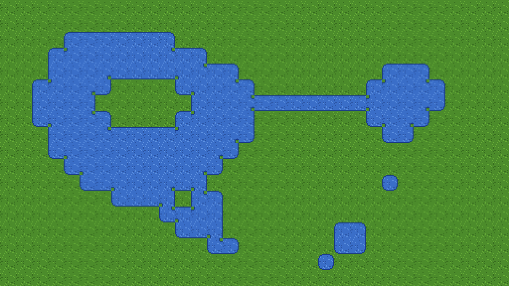

# Free animated water autotile — 47-tile blob, 4 frames per tile, water over grass — Godot 4



A **47-tile blob water terrain where every tile is already animated**: 4 frames,
0.2 s each, laid out so Godot accepts the animation. Water is drawn **over grass**,
so a pond or lake painted with Connect has no transparent corners. 16px and 32px,
plus a painted demo scene. **MIT: use it in commercial games, no credit required.**
Needs Godot 4.3 or newer.

**[⬇ The whole pack in one zip](https://github.com/leobaray/blobsmith-autotile-wirer/releases/download/animated-water-pack-v1/godot-animated-water-pack.zip)**
— the same bytes as the files below, with the licence inside it.

| file | what it is |
|---|---|
| `animated_water_16px.png` + `.tres` | TileSet, 16px tiles, sheet 512×96 |
| `animated_water_32px.png` + `.tres` | TileSet, 32px tiles, sheet 1024×192 |
| `animated_water_demo.tscn` | a painted 32×18 pond and a camera (uses the 16px TileSet) |
| `animated_water_preview.gif` | the animation above (4 frames, 2× scale) |
| `animated_water_preview.png` | frame 0 of the same picture |
| `manifest.json` | the layout, the mask of every tile and the animation values, as data |

## Use it (~20 seconds)

1. Copy **both** files of one size — the `.png` and the `.tres` — into the same
   folder of your project. Let the editor import the PNG.
2. Add a `TileMapLayer` and set its `TileSet` to the `.tres`.
3. TileMap panel → **Terrains** tab → **Connect** mode. Paint **Grass** over the
   area first, then paint **Water** on top of it. Erase water by painting Grass
   back over it. Run the scene: the water moves (the editor viewport animates it
   too).

From code, the same two strokes:

```gdscript
layer.set_cells_terrain_connect(area_cells, 0, 1, false)   # terrain set 0, terrain 1 = Grass
layer.set_cells_terrain_connect(water_cells, 0, 0, false)  # terrain set 0, terrain 0 = Water
```

Pass `false` as the last argument: with the default `true`, the cells on the
outer edge of the painted area stay empty, because no tile here has an "empty"
neighbour.

Or open `animated_water_demo.tscn` and press **F6**.

## Layout

32×6 cells. The 47 water tiles are in the same ascending canonical-mask order as
the [starter pack](../starter-pack/) (8 per row), but each takes **4 cells**: the
tile, then its frames 1, 2 and 3 to its right. Tile `i` is at
`(4 * (i % 8), i / 8)`; `(28,5)` is the full grass tile (not animated); `(29..31,5)`
are empty. Terrain set 0, Match Corners and Sides, terrain 0 `Water`, terrain 1
`Grass`. No collision.

Each water tile: `animation_columns` 4, 4 frames of 0.2 s, speed 1, mode
`DEFAULT`, separation `(0,0)`.

## The animation, and the three ways it goes wrong

Measured in [why my animated tile does not animate](../../docs/why-my-animated-tile-does-not-animate.md):

- **Frame cells are not tiles.** Only the 48 base cells are tiles
  (`get_tiles_count()` is 48, not 189). If you re-import this PNG and let the
  editor "create tiles in non-transparent areas", the frame cells become tiles
  and the animation is refused. Use the `.tres` as shipped, or delete those tiles.
- **Paint the base tile's coordinate, never a frame's.** A cell set to a frame
  cell (e.g. `(1,0)`) draws nothing. Connect already does it right.
- **Mode stays `DEFAULT`.** Every cell shows the same frame at the same time,
  which is what keeps the ripples continuous across tile edges.
  `RANDOM_START_TIMES` would break them at every seam.

To freeze the water (a pause menu), `get_tree().paused` does **not** stop tile
animation; set the frame count of the tiles to 1 and back (measured on the same
page). To make it slower, raise the frame durations or lower `animation_speed`
in the TileSet panel.

The frames are the water texture shifted by a quarter tile right and down per
frame, so frame 4 would be frame 0 again and the texture stays seamless across
tiles; the border and blob shape do not move.

## Verified, not asserted

`verify_animated_water.sh /path/to/godot` builds a throwaway project with this
folder in it, loads both TileSets and the demo scene, paints with
`set_cells_terrain_connect`, and reads the animation frame on screen back from
rendered pixels (on a virtual X server, `xvfb-run`, at `--fixed-fps 60`). On
2026-09-17: **23/23 checks on each of Godot 4.3, 4.4 and 4.7 stable**, with the
same measured values on all three.

| id | claim |
|---|---|
| W1 | the demo run as the main scene for 60 frames prints 0 `ERROR` lines |
| W2 | the verification run prints 0 `ERROR` lines |
| W3 | for each size: loads with its PNG, 1 atlas source, sheet size as in the manifest |
| W4 | `get_tiles_count()` is 48; the 141 frame cells are not tiles (`has_tile` false) and `get_tile_at_coords()` on each returns its base tile |
| W5 | one terrain set, Match Corners and Sides, `Water` = 0, `Grass` = 1 |
| W6 | all 47 water tiles: 4 frames, columns 4, durations 0.2 s ×4, speed 1, mode `DEFAULT`, separation `(0,0)`; the grass tile has 1 frame |
| W7 | tile `i` of the canonical 47-mask table is at `(4*(i%8), i/8)` and its 8 peering bits are Water exactly where the mask has a neighbour; the grass tile is Grass on all 8 |
| W8 | Connect paints Grass over a 192-cell field, then Water over 41 cells (hole, one-cell peninsula, lone cell, corner touch, one-cell channel): 0 cells empty, every cell's atlas coords are the canonical-table tile (22 distinct water tiles) |
| W9 | control: a copy with every tile cut to 1 frame fails the W6 audit on all 47 tiles, and paints the same atlas coords cell for cell — animation takes no part in terrain matching |
| W10 | control: a copy whose full-water tile has one corner bit set to Grass is caught by the W8 comparison (3 cells off the table) |
| W11 | rendered: the full-water and lone-cell tiles show atlas frames 0, 1, 2, 3 in order, 12 rendered frames each (0.2 s at 60 fps), both in step, every rendered frame pixel-equal to an atlas frame |
| W12 | control: the 1-frame copy renders frame 0 on all 60 frames (1 distinct frame) |
| W13 | the demo scene loads; its `Pond` layer uses the 16px TileSet and holds 576 cells, 147 water, every water cell on the canonical-table tile for its painted neighbours |

W3–W12 run once per size. `--invert` flips W6 and W8 on purpose: 4 FAILs, exit 1
on all three versions. A GDScript parse error exits 3, not 0. What is **not**
checked: the editor's TileSet panel, real wall-clock timing, and 4.2 (no
`TileMapLayer`).

One thing measured while writing the checks: frame durations are stored as
32-bit floats, so `get_tile_animation_frame_duration()` returns
`0.20000000298…` and `== 0.2` is `false` in GDScript. Compare with
`is_equal_approx`.

Procedural placeholder art, generated by `make-animated-water-pack.js` in the
Blobsmith build repo from the same water and grass base blocks as the starter
pack. The demo pond's tiles were painted by Godot 4.3 with
`set_cells_terrain_connect`, not by hand.

## License

MIT — [`LICENSE`](../../LICENSE). The art, the `.tres` and the scene.
