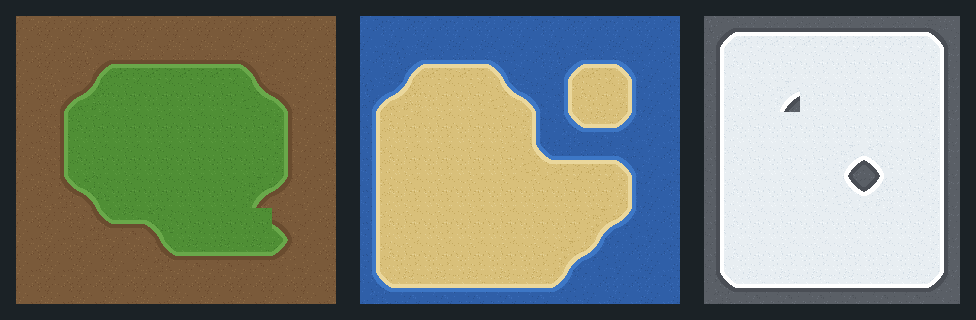

# Free corner-terrain tileset pack (Match Corners, 16 tiles) — Godot 4

Eight ready-to-paint **Match Corners** TileSets. **MIT: use them in commercial
games, no credit required.** Godot 4 has three terrain modes and this is the cheap
one: the terrain lives on the four **corners** of the cell, so a complete set is
**2⁴ = 16 tiles instead of the 47** a corners-and-sides terrain needs, and the
boundary runs diagonally through the cell instead of following its edges. Every
`.tres` here is already wired, all 16 combinations present. You do not run
anything to use these; you drop two files in and paint.



*That picture is not a mockup: Godot painted every panel with
`set_cells_terrain_connect`, and the preview script only blitted the tiles the
engine chose, in the cells the engine wrote them to — including the cells nobody
listed (see below).*

| terrain | 16px | 32px | over | collision |
|---|---|---|---|---|
| Grass | `grass_corners_16px` | `grass_corners_32px` | soil   | none |
| Sand  | `sand_corners_16px`  | `sand_corners_32px`  | water  | none |
| Snow  | `snow_corners_16px`  | `snow_corners_32px`  | rock   | none |
| Lava  | `lava_corners_16px`  | `lava_corners_32px`  | basalt | none |

Sheets are 4×4 cells: 64×64 for 16px, 128×128 for 32px. The tiles are **opaque**:
each one already carries its own background, so one `TileMapLayer` is enough —
you are not painting over a ground layer, you are painting the ground.

## Use it (3 steps, ~20 seconds)

1. Copy **both** files of one entry — the `.png` **and** the `.tres` — into your
   project, any folder. They must land in the *same* folder: the `.tres` points
   at the PNG by filename, on purpose, so the pair works wherever you put it.
2. Let the editor import the PNG (it does this by itself when the Godot window
   regains focus). Don't copy any `.import` file from here — Godot writes its own.
3. Set a `TileMapLayer`'s `TileSet` to the `.tres`, open the **TileMap** panel →
   **Terrains** tab and paint. Connect mode is the right one here.

No plugin needed for this pack.

## The one rule, and where it surprises you

Painting with `set_cells_terrain_connect` obeys a single rule, measured on Godot
4.3, 4.4 and 4.7 over a shape with a straight run, an L, a hole, a diagonal touch
and a lone cell — **55 of its 56 cells**, the exception below:

> a corner of a cell carries the terrain exactly when **at least one** of the four
> cells meeting at that corner was painted.

Three consequences, all measured:

**1. It writes tiles into cells you did not list.** The boundary has to be drawn
*somewhere*, and in a corner terrain it is drawn in the ring around your shape:
the 24-cell shape above put tiles into **35 cells nobody listed**. Leave a
one-cell margin around what you paint, and remember that erasing the shape leaves
that ring behind unless you erase it too.

**2. A one-cell hole does not survive.** Leave one cell out of a block and the
terrain closes over it — it comes back as a notch on a single corner (mask 14),
not as a hole. The smallest hole that survives is **2×2**, where each of the four
cells clears the corner facing the middle (masks 14, 13, 7, 11). The right-hand
panel of the picture is exactly that: the small triangle is the one-cell hole that
closed, the diamond is the 2×2 that did not.

**3. Cells that touch only at a corner come out joined.** That is the mode's
selling point for organic terrain — no diagonal seam, no separate inner-corner
tile — and the reason a lone painted cell comes out solid, with its eight
neighbours carrying the edge.

### If you want the opposite behaviour

Give **every** tile the terrain instead of only the solid one — in the `.tres`,
change the 15 lines reading `/terrain = -1` to `/terrain = 0`:

```sh
sed -i 's|/terrain = -1|/terrain = 0|' grass_corners_16px.tres
```

Measured on 4.3, 4.4 and 4.7: the engine then writes **nothing** outside the cells
you listed, and draws the boundary *inside* the painted area instead — at the cost
that a lone painted cell comes out with no terrain on any corner, i.e. invisible.
Neither behaviour is a bug; pick the one your level needs.

## Why 16 tiles

The atlas index is the mask: tile `(i % 4, i / 4)` carries the terrain on its
bottom-right corner when bit 1 of *i* is set, bottom-left 2, top-left 4,
top-right 8. All 16 are present, so nothing ever falls back to a "closest" tile.

The art is a bilinear field over the four corner values, terrain where the field
is above ½, with a shading band along the boundary. That is also why the sheet
tiles seamlessly: along the shared edge of two cells the field depends only on the
two corners they share, so it is the same function on both sides. Replace the art
with your own drawing tile-for-tile and the wiring still holds.

## What is checked, and on which engines

`verify_corners_pack.sh` runs 136 checks against a real Godot binary — 17 per
TileSet — and they pass identically on **Godot 4.3, 4.4 and 4.7 stable**:

```
examples/corners/verify_corners_pack.sh /path/to/Godot_v4.4-stable_linux.x86_64
```

It works from the unzipped download as well as from a clone. It loads every
`.tres`, asserts the shape, cell size, terrain mode and name by their **enum
names**, that the 16 tiles cover all 16 corner combinations, and that there is no
physics layer. Then it paints the shape described above and demands that in
**every** cell of the region each corner carries the terrain exactly where the
engine's own `get_neighbor_cell` finds a painted cell meeting that corner — and it
measures the ring (35 cells), the one-cell hole (mask 14), the 2×2 hole, the
diagonal touch, the lone cell, and the `/terrain = 0` switch above.

`verify_corners_pack.sh <godot> --invert` flips one expectation and must exit 1 —
a gate that cannot fail is not a gate. Godot 4.2 is not supported: `TileMapLayer`
does not exist there.

## License

MIT (`LICENSE.txt` in the zip, `LICENSE` in the repo). Use the art and the
TileSets in anything, commercial included, no credit required.

Made with [Blobsmith](https://blobsmith.itch.io/blobsmith-lite) — the free
in-browser 47-blob autotile maker for Godot 4.
