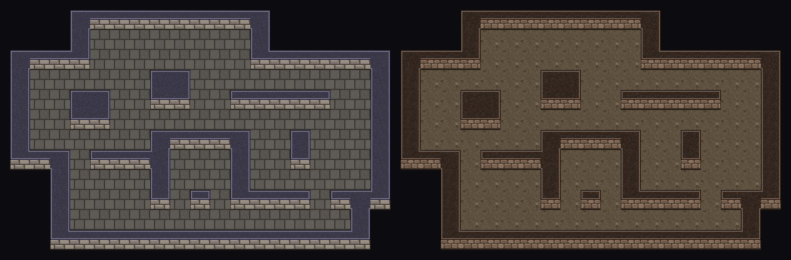

# Free top-down dungeon tileset pack — Godot 4

Four ready-to-paint **top-down (3/4 view) dungeon** TileSets. **MIT: use them in
commercial games, no credit required.** Every `.tres` here is already wired: the
walls are a 47-tile blob terrain, and every wall tile whose **south side is open
draws its front face** — so when you paint walls with Connect, the faces appear by
themselves on exactly the walls that have floor below them. Walls carry a
full-cell collision square; the floor has none.



*That picture is not a mockup: Godot laid the floor with `set_cell`, painted the
walls on top with `set_cells_terrain_connect`, and the preview script only blitted
the tiles the engine chose at the cell positions the engine reported.*

| style | 16px | 32px | terrain name |
|---|---|---|---|
| Stone brick walls on flagstone floor | `stone_dungeon_16px` | `stone_dungeon_32px` | `Stone Wall` |
| Rough rock walls on dirt floor | `cave_dungeon_16px` | `cave_dungeon_32px` | `Cave Wall` |

Sheets are 8×6 cells: 128×96 for 16px, 256×192 for 32px. Atlas cells 0–46 are the
47 wall tiles; the last cell, **(7, 5), is the floor**.

## Use it (4 steps, ~30 seconds)

1. Copy **both** files of one entry — the `.png` **and** the `.tres` — into your
   project, any folder. They must land in the *same* folder: the `.tres` points
   at the PNG by filename, on purpose, so the pair works wherever you put it.
2. Let the editor import the PNG (it does this by itself when the Godot window
   regains focus). Don't copy any `.import` file from here — Godot writes its own.
3. Add a `TileMapLayer`, set its `TileSet` to the `.tres`. In the **TileMap**
   panel → **Tiles** tab, pick the floor tile (bottom-right of the atlas) and
   paint the room's floor (the rectangle tool is fastest).
4. Switch to the **Terrains** tab, pick **Connect** mode and the wall terrain, and
   paint the walls over the floor. Faces, corners and 1-wide walls sort
   themselves out as you draw; erase or repaint and the neighbours update.

No plugin needed for this pack.

## How the face works

A wall seen from above in 3/4 view shows its top; where the room is *south* of
it, it also shows its front. Whether a wall cell needs a face depends on one
neighbour — the cell below — and that is already one of the eight bits of the
47-blob mask. So the 13 wall tiles with the south side open are drawn with the
cap on the upper half and the face on the lower half; the other 34 are all cap.
The engine's pick for the neighbourhood *is* the choice of face or no face.

The floor tile has **no terrain**. To the wall terrain, a cell with no terrain is
"not wall" — the same as an empty cell — so walls against the floor and walls
against the void outside the dungeon read the same way, and painting walls
never rewrites the floor around them.

Each wall tile also carries a `wall_face` custom data bool (true on the 13 face
tiles), for scripts that want to know — for example to sort a character in front
of or behind a wall.

## What is checked, and on which engines

`verify_dungeon_pack.sh` runs 64 checks against a real Godot binary — 16 per
TileSet — and they pass identically on **Godot 4.3, 4.4 and 4.7 stable**:

```
examples/dungeon/verify_dungeon_pack.sh /path/to/Godot_v4.4-stable_linux.x86_64
```

It works from the unzipped download as well as from a clone. For each TileSet it
checks the load, the atlas size, 48 tiles, the terrain mode and name, that the 47
wall tiles carry all 47 canonical peering combinations and the full-cell
collision square, and that the floor has no terrain and no collision. Then it
floors a test room (corridors, pillars, 1-wide walls, thick blocks — 129 wall
cells) plus a sweep of all 47 neighbourhoods painted in isolation, paints the
walls with `set_cells_terrain_connect`, and demands:

- every one of the 364 wall cells gets the tile whose bits match its real
  neighbours, and every floor cell is still floor;
- each of the 47 sweep centres lands on the tile of its mask (all 47 reachable);
- the front face shows on **exactly** the wall cells with floor to the south —
  read from the **pixels** of the tile the engine picked, not from metadata;
- collision on wall cells only;
- painting the walls one cell at a time (the way editor strokes arrive) gives
  the same map as one call.

`verify_dungeon_pack.sh <godot> --invert` flips one expectation and must exit 1 —
a gate that cannot fail is not a gate. Godot 4.2 is not supported: `TileMapLayer`
does not exist there.

## License

MIT (`LICENSE.txt` in the zip, `LICENSE` in the repo). Use the art and the
TileSets in anything, commercial included, no credit required.

Made with [Blobsmith](https://blobsmith.itch.io/blobsmith-lite) — the free
in-browser 47-blob autotile maker for Godot 4.
