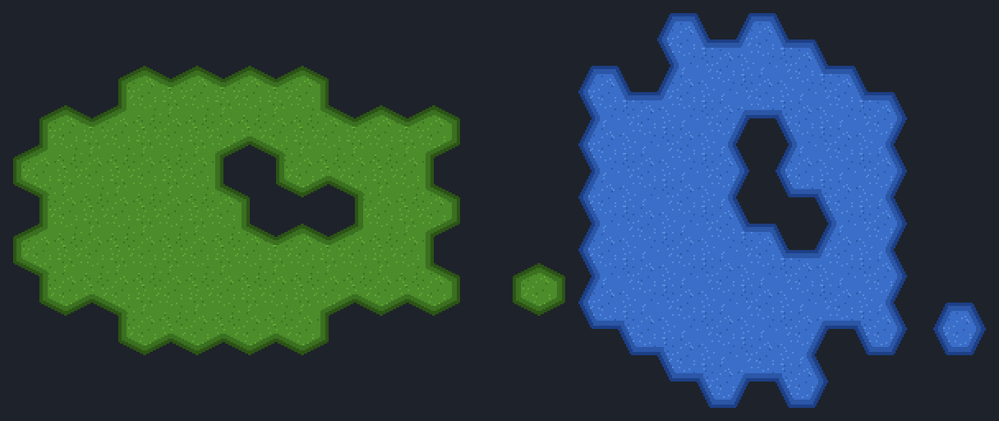

# Free hexagon terrain tileset pack — Godot 4

Sixteen ready-to-paint **hexagon** TileSets. **MIT: use them in commercial games,
no credit required.** Every `.tres` here is already wired — `tile_shape` Hexagon,
the right `tile_offset_axis` for its orientation, a Match Sides terrain set with a
tile for **every one of the 64 side combinations**, and a hexagon collision
polygon. You do not run anything to use these; you drop two files in and paint.



*That picture is not a mockup: Godot painted both islands with
`set_cells_terrain_connect`, and the preview script only blitted the tiles the
engine chose at the cell positions the engine reported.*

| terrain | pointy-top 16px | pointy-top 32px | flat-top 16px | flat-top 32px | terrain name |
|---|---|---|---|---|---|
| Grass | `grass_hex_pointy_16px` | `grass_hex_pointy_32px` | `grass_hex_flat_16px` | `grass_hex_flat_32px` | `Grass` |
| Stone | `stone_hex_pointy_16px` | `stone_hex_pointy_32px` | `stone_hex_flat_16px` | `stone_hex_flat_32px` | `Stone` |
| Sand  | `sand_hex_pointy_16px`  | `sand_hex_pointy_32px`  | `sand_hex_flat_16px`  | `sand_hex_flat_32px`  | `Sand` |
| Water | `water_hex_pointy_16px` | `water_hex_pointy_32px` | `water_hex_flat_16px` | `water_hex_flat_32px` | `Water` |

Sheets are 8×8 cells: 128×128 for 16px, 256×256 for 32px. The cell is square
(16×16 or 32×32), so every slanted edge is an exact 2:1 (pointy-top) or 1:2
(flat-top) pixel line.

## Use it (3 steps, ~20 seconds)

1. Copy **both** files of one entry — the `.png` **and** the `.tres` — into your
   project, any folder. They must land in the *same* folder: the `.tres` points
   at the PNG by filename, on purpose, so the pair works wherever you put it.
2. Let the editor import the PNG (it does this by itself when the Godot window
   regains focus). Don't copy any `.import` file from here — Godot writes its own.
3. Add a `TileMapLayer`, set its `TileSet` to the `.tres`, open the **TileMap**
   panel → **Terrains** tab, pick **Connect** mode, and paint.

No plugin needed for this pack.

## Pointy-top or flat-top is `tile_offset_axis`

| you want | `tile_offset_axis` | rows/columns | files |
|---|---|---|---|
| pointy-top hexes (rows staggered) | `Horizontal` (0, the default) | row spacing 3/4 of the cell, odd rows shifted half a cell right | `*_hex_pointy_*` |
| flat-top hexes (columns staggered) | `Vertical` (1) | column spacing 3/4 of the cell, odd columns shifted half a cell down | `*_hex_flat_*` |

## Why 64 tiles, and no corners

A hexagon has no corner-only neighbour: every cell that touches it shares a whole
edge. So the terrain set is **Match Sides**, the six side bits are the entire
neighbourhood, and every one of the 2⁶ = 64 combinations can occur on a real map.
This pack has all 64 — nothing falls back to a "closest" tile. The atlas index is
the mask: tile `(i % 8, i / 8)` connects on side *k* when bit *k* of *i* is set,
sides in the order of the table below.

The art is simple on purpose: open fill where a side connects, a dark outline
where it does not. Replace it with your own drawing tile-for-tile and the wiring
still holds.

## The trap: the peering-bit NAMES depend on the offset axis

Measured on 4.3, 4.4 and 4.7 (`is_valid_terrain_peering_bit` and
`get_neighbor_cell` from cell `(0, 0)`):

| side order | pointy-top (`Horizontal`) | reaches | flat-top (`Vertical`) | reaches |
|---|---|---|---|---|
| 0 | `right_side` | (1, 0) | `bottom_right_side` | (1, 0) |
| 1 | `bottom_right_side` | (0, 1) | `bottom_side` | (0, 1) |
| 2 | `bottom_left_side` | (-1, 1) | `bottom_left_side` | (-1, 0) |
| 3 | `left_side` | (-1, 0) | `top_left_side` | (-1, -1) |
| 4 | `top_left_side` | (-1, -1) | `top_side` | (0, -1) |
| 5 | `top_right_side` | (0, -1) | `top_right_side` | (1, -1) |

The same name reaches a **different** cell on each axis (`bottom_right_side` is
`(0, 1)` pointy-top and `(1, 0)` flat-top), and `right_side`/`left_side` exist only
pointy-top while `top_side`/`bottom_side` exist only flat-top. Neighbours also
depend on the row (or column) parity — that is what "offset" means — so always ask
`get_neighbor_cell()` instead of adding a fixed vector.

Consequence: **a hex TileSet wired on one axis and then switched to the other
still loads and still fills the map, with the wrong edges and no error.** The gate
below measures it: flip any of these sixteen to the other axis and 60 of the 61
cells of the test island come out with at least one wrong side. If you change the
orientation, take the other file — don't flip the property.

## The collision polygon is the hexagon

Every tile carries one six-point polygon on physics layer 1 — the cell's own
outline, relative to the tile centre. A square polygon would stick out into the
neighbouring cells on four of the six sides.

## What is checked, and on which engines

`verify_hex_pack.sh` runs 256 checks against a real Godot binary — 16 per
TileSet — and they pass identically on **Godot 4.3, 4.4 and 4.7 stable**:

```
examples/hex/verify_hex_pack.sh /path/to/Godot_v4.4-stable_linux.x86_64
```

It works from the unzipped download as well as from a clone. It loads every
`.tres`, asserts the shape and offset axis by their **enum names**, the cell size,
the terrain mode and name, the physics layer, that all 64 tiles carry the hexagon
polygon and that the 64 tiles cover all 64 side combinations. It measures the
layout (the next row or column is offset by 3/4 of a cell and staggered by half),
then paints a 61-cell ragged island with holes and a one-neighbour spur, and
demands that in **every** painted cell each of the six sides connects exactly
where the engine's own `get_neighbor_cell` finds a painted neighbour. The last
check is the axis trap above, measured.

`verify_hex_pack.sh <godot> --invert` flips one expectation and must exit 1 — a
gate that cannot fail is not a gate. Godot 4.2 is not supported: `TileMapLayer`
does not exist there.

## License

MIT (`LICENSE.txt` in the zip, `LICENSE` in the repo). Use the art and the
TileSets in anything, commercial included, no credit required.

Made with [Blobsmith](https://blobsmith.itch.io/blobsmith-lite) — the free
in-browser 47-blob autotile maker for Godot 4.
