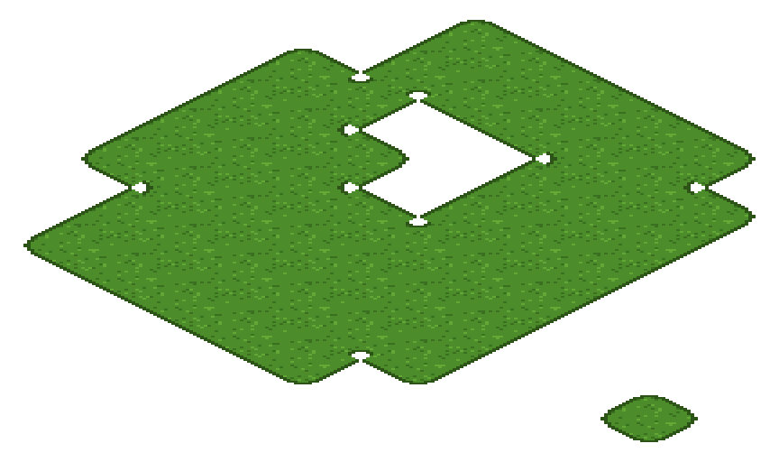

# Free isometric 47-blob tileset pack — Godot 4

Eight ready-to-paint **isometric** TileSets. **MIT: use them in commercial games,
no credit required.** Every `.tres` here is already wired — `tile_shape`
Isometric **and** `tile_layout` Diamond Right, terrain set configured, terrain
peering bits on all 47 tiles, and the collision polygon is the diamond footprint
rather than the bounding box. You do not run anything to use these; you drop two
files in and paint.



*That picture is not a mockup: Godot painted it with `set_cells_terrain_connect`
and the preview script only blitted the tiles the engine chose.*

| terrain | 16px art (32×16 cell) | 32px art (64×32 cell) | terrain name in the editor |
|---|---|---|---|
| Grass | `grass_iso47_16px` | `grass_iso47_32px` | `Grass` |
| Stone | `stone_iso47_16px` | `stone_iso47_32px` | `Stone` |
| Sand  | `sand_iso47_16px`  | `sand_iso47_32px`  | `Sand` |
| Water | `water_iso47_16px` | `water_iso47_32px` | `Water` |

Sheets are 8×6 cells: 256×96 for the 16px art, 512×192 for the 32px art.

## Use it (3 steps, ~20 seconds)

1. Copy **both** files of one entry — the `.png` **and** the `.tres` — into your
   project, any folder. They must land in the *same* folder: the `.tres` points
   at the PNG by filename, on purpose, so the pair works wherever you put it.
2. Let the editor import the PNG (it does this by itself when the Godot window
   regains focus). Don't copy any `.import` file from here — Godot writes its own.
3. Add a `TileMapLayer`, set its `TileSet` to the `.tres`, open the **TileMap**
   panel → **Terrains** tab, pick **Connect** mode, and paint.

No plugin needed for this pack.

## The two properties that make it isometric

If you have built an isometric TileSet by hand and got a rectangle of overlapping
tiles, this is why: **`tile_shape` and `tile_layout` are separate properties, and
setting the shape does not set the layout.** A new TileSet starts at `Stacked`
and stays there after you pick Isometric — a real, supported combination that is
simply not the diamond you wanted.

```gdscript
tile_set.tile_shape  = TileSet.TILE_SHAPE_ISOMETRIC
tile_set.tile_layout = TileSet.TILE_LAYOUT_DIAMOND_RIGHT   # the line people miss
```

Both are already set in every `.tres` here. The long version, with the
measurements, is in [docs/why-my-isometric-tilemap-is-not-a-diamond.md](../../docs/why-my-isometric-tilemap-is-not-a-diamond.md).

## The cell is 2:1, and that is the footprint — not the art size

`tile_size` is the **grid**, so it is the diamond's bounding box: `(32, 16)` for
the 16px art, `(64, 32)` for the 32px art. These tiles are flat ground, drawn
entirely inside that box, so nothing else is needed.

If you replace the art with taller blocks — a cube, a wall, a tree — do **not**
raise `tile_size` to fit them; that spreads every cell apart. Raise the atlas
region and push the drawing up with `TileData.texture_origin` instead.

## The collision polygon is the diamond

Every tile carries one polygon on physics layer 1, with the four points
`(-W/2, 0) (0, -H/2) (W/2, 0) (0, H/2)`. A square polygon — what you get by
copying a square tileset's collision shape — would stick out half a tile into
empty space on all four diagonals, and a body would stop short of ground it can
see.

## Peering bits: the isometric names are the *other* ones

On an isometric TileSet the four cells that share an **edge** with `(0, 0)` are
`TOP_RIGHT_SIDE` (1,0), `BOTTOM_RIGHT_SIDE` (0,1), `BOTTOM_LEFT_SIDE` (-1,0) and
`TOP_LEFT_SIDE` (0,-1) — the same four cells a square TileSet reaches with
`RIGHT/BOTTOM/LEFT/TOP_SIDE`. The diagonals swap the same way:
`BOTTOM_RIGHT_CORNER` on a square is `RIGHT_CORNER` here. Godot does not
translate for you: `get_neighbor_cell(c, CELL_NEIGHBOR_RIGHT_SIDE)` returns `c`
unchanged on an isometric layer, so code ported from a square map silently stops
moving.

Every tile in this pack is wired with the isometric names.

## What is checked, and on which engines

`verify_isometric_pack.sh` runs 128 checks against a real Godot binary — 16 per
TileSet — and they pass identically on **Godot 4.3, 4.4 and 4.7 stable**:

```
examples/isometric/verify_isometric_pack.sh /path/to/Godot_v4.4-stable_linux.x86_64
```

Run it from a clone of the repo, not from the unzipped download: the last check
below needs the square `starter-pack` folder next to this one, and without it the
script refuses to run rather than report a green gate missing its main claim.

It loads every `.tres`, asserts the shape and layout by their **enum names** (not
by the integers they happen to have today), asserts the cell size, the terrain
mode and name, the physics layer, and that all 47 tiles carry the *diamond*
polygon. Then it measures the layout — `+x` must move half a cell right and half
a cell **up** — and paints a 37-cell ragged island with holes.

The last check is the one that matters. These tiles are the square starter pack's
tiles rotated onto the diamond, and their peering bits are the square pack's bits
renamed. So the gate paints the same cells on the isometric tileset **and** on
the square `starter-pack` tileset of the same terrain and size, and demands the
same tile in every cell. A rename rotated by one step would still fill the
island, still look plausible, and disagree there.

`verify_isometric_pack.sh <godot> --invert` perturbs one cell of that comparison
and must exit 1 — a gate that cannot fail is not a gate.

## License

MIT (`LICENSE.txt` in the zip, `LICENSE` in the repo). Use the art and the
TileSets in anything, commercial included, no credit required.

Made with [Blobsmith](https://blobsmith.itch.io/blobsmith-lite) — the free
in-browser 47-blob autotile maker for Godot 4.
