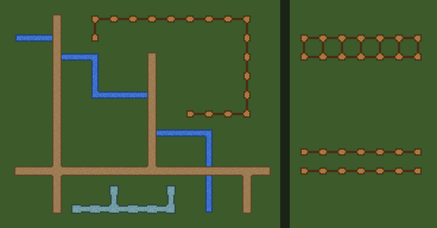

# Free roads, fences, pipes & streams tileset pack — Godot 4

Eight ready-to-paint **line-connector** TileSets: things drawn as a line through
the cell, not as an area. **MIT: use them in commercial games, no credit
required.** Every `.tres` here is already wired — a Match Sides terrain set with a
tile for **every one of the 16 side combinations** (lone post, dead end, straight,
corner, T, cross), and collision on fences and pipes. You do not run anything to
use these; you drop two files in and paint.



*That picture is not a mockup: Godot painted every cell, and the preview script
only blitted the tiles the engine chose at the cell positions the engine reported.
The ground is a flat colour — the tiles are transparent outside the line.*

| kind | 16px | 32px | terrain name | collision |
|---|---|---|---|---|
| Road   | `road_lines_16px`   | `road_lines_32px`   | `Road`   | none — walk on it |
| Fence  | `fence_lines_16px`  | `fence_lines_32px`  | `Fence`  | post + one bar per connected side |
| Pipe   | `pipe_lines_16px`   | `pipe_lines_32px`   | `Pipe`   | body + one bar per connected side |
| Stream | `stream_lines_16px` | `stream_lines_32px` | `Stream` | none |

Sheets are 4×4 cells: 64×64 for 16px, 128×128 for 32px.

## Use it (3 steps, ~20 seconds)

1. Copy **both** files of one entry — the `.png` **and** the `.tres` — into your
   project, any folder. They must land in the *same* folder: the `.tres` points
   at the PNG by filename, on purpose, so the pair works wherever you put it.
2. Let the editor import the PNG (it does this by itself when the Godot window
   regains focus). Don't copy any `.import` file from here — Godot writes its own.
3. Add a **second** `TileMapLayer` above your ground layer, set its `TileSet` to
   the `.tres`, open the **TileMap** panel → **Terrains** tab and paint — in
   **Path** mode for fences and pipes (read the next section), Connect is fine for
   roads.

No plugin needed for this pack.

## The trap: Connect joins lines that only run side by side

Two fences one cell apart are two fences. `set_cells_terrain_connect` (the
editor's **Connect** mode) does not know that: it connects every painted cell to
every painted neighbour, so the pair comes out as **a ladder** — every cell gets a
rung to the fence next to it. It happens **even when each fence is painted by its
own call**: the second call re-picks the tiles of the first fence along its edge.
No error, no warning.

`set_cells_terrain_path` (the editor's **Path** mode) connects each cell only to
the cell before and after it *in the list you give it*. Same two fences, one call
each: two clean fences.

Measured on Godot 4.3, 4.4 and 4.7, two rows of six cells, masks read back with
`get_terrain_peering_bit` (1 right, 2 bottom, 4 left, 8 top):

| how | row 0 | row 1 |
|---|---|---|
| Connect, both rows in one call | `3 7 7 7 7 6` | `9 13 13 13 13 12` |
| Connect, one call per row | `3 7 7 7 7 6` | `9 13 13 13 13 12` |
| Path, one call per row | `1 5 5 5 5 4` | `1 5 5 5 5 4` |

To branch with Path, start the branch **on** the existing line: the path
`(2,0) → (2,1) → (2,2)` turns `(2,0)` into a T and leaves `(1,0)` and `(3,0)`
alone.

Rule of thumb: **Path** for anything that can run parallel to itself — fences,
pipes, rails, walls of one-tile thickness. **Connect** is fine where touching
means joined — a road grid, a stream you paint as a blob of cells.

## Why 16 tiles, and no corners

A line only cares about the four cells it can run into, so the terrain set is
**Match Sides** and the four side bits are the whole story: 2⁴ = 16 combinations,
all present, nothing falls back to a "closest" tile. The atlas index is the mask:
tile `(i % 4, i / 4)` connects on the right when bit 1 of *i* is set, bottom 2,
left 4, top 8.

The art is simple on purpose: a centre piece plus an arm to each connected edge,
outlined where the line stops. Replace it with your own drawing tile-for-tile and
the wiring still holds.

## What is checked, and on which engines

`verify_lines_pack.sh` runs 120 checks against a real Godot binary — 15 per
TileSet — and they pass identically on **Godot 4.3, 4.4 and 4.7 stable**:

```
examples/lines/verify_lines_pack.sh /path/to/Godot_v4.4-stable_linux.x86_64
```

It works from the unzipped download as well as from a clone. It loads every
`.tres`, asserts the shape, cell size, terrain mode and name by their **enum
names**, that the 16 tiles cover all 16 side combinations, and the collision
(fence and pipe: the post plus exactly one rectangle per connected side; road
and stream: no physics layer). It paints a 25-cell network — a loop, a cross,
T-junctions, a dead end, a lone post — with Connect and demands that in **every**
cell each side connects exactly where the engine's own `get_neighbor_cell` finds
a painted neighbour. Then it measures the trap above: Connect turns two parallel
lines into a ladder (6/6 rungs, painted in one call or one call per line), Path keeps them apart (12/12 clean), and a Path
branch started on the line makes a T.

`verify_lines_pack.sh <godot> --invert` flips one expectation and must exit 1 — a
gate that cannot fail is not a gate. Godot 4.2 is not supported: `TileMapLayer`
does not exist there.

## License

MIT (`LICENSE.txt` in the zip, `LICENSE` in the repo). Use the art and the
TileSets in anything, commercial included, no credit required.

Made with [Blobsmith](https://blobsmith.itch.io/blobsmith-lite) — the free
in-browser 47-blob autotile maker for Godot 4.
