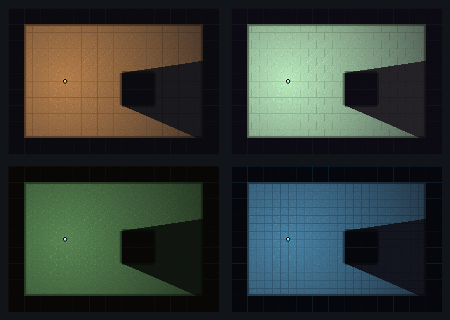

# Free light-occluder tileset pack (floor + wall, Match Sides) — Godot 4

Eight ready-to-paint **top-down floor + wall** TileSets where the wall already
carries a light occluder, so a `PointLight2D` with shadows on casts wall shadows
the moment the room is painted — plus a tool that checks **your own** TileSet,
and your own scene, for the ways a 2D shadow setup silently casts nothing.
**MIT: use them in commercial games, no credit required.** You do not run
anything to use these; you drop two files in and paint.



*Nothing in that picture was drawn by hand. Godot painted each room with
`set_cells_terrain_connect`, lit it with one `PointLight2D` (shadows on) under a
`CanvasModulate`, and rendered the frame; the only thing added afterwards is the
small dot marking where the light is.*

| theme | 16px | 32px | floor | wall |
|---|---|---|---|---|
| Dungeon | `dungeon_occ_16px` | `dungeon_occ_32px` | flagstones | dark stone |
| Crypt   | `crypt_occ_16px`   | `crypt_occ_32px`   | pale slabs | purple-grey stone |
| Forest  | `forest_occ_16px`  | `forest_occ_32px`  | moss | tree bark |
| Scifi   | `scifi_occ_16px`   | `scifi_occ_32px`   | deck plates | steel, cyan rim |

Each TileSet is one **Match Sides** terrain set with two terrains — terrain 0
**Floor** and terrain 1 **Wall** — and **17 tiles**: 16 floor tiles and one wall
tile. Sheets are 5×4 cells: 80×64 for 16px, 160×128 for 32px (the three cells
under the wall tile are empty and are not tiles).

* **The wall tile** has a full-cell occluder polygon on occlusion layer 0, whose
  `light_mask` is **1** — the value `PointLight2D.shadow_item_cull_mask` ships
  with — and a full-cell collision polygon on physics layer 0
  (`collision_layer = 1`). Both are authored in the tile's own centred
  coordinates, `(-8,-8)..(8,8)` at 16px, not `(0,0)..(16,16)`.
* **Every floor tile** has no occluder and no collision.

Same terrain layout as the free walkable-floor navigation pack: the edge between
a floor cell and a wall cell belongs to the wall, so the floor has 2⁴ = 16
variants (a darker band on each side that touches a wall) and one wall tile fits
every wall cell.

## Use it (3 steps, ~20 seconds)

1. Copy **both** files of one entry — the `.png` **and** the `.tres` — into your
   project, any folder. They must land in the *same* folder: the `.tres` points at
   the PNG by filename, on purpose, so the pair works wherever you put it.
2. Let the editor import the PNG (it does this by itself when the Godot window
   regains focus). Don't copy any `.import` file from here — Godot writes its own.
3. Set a `TileMapLayer`'s `TileSet` to the `.tres`, open the **TileMap** panel →
   **Terrains** tab, choose Connect, and paint **Floor first, then Wall** on the
   same layer. Add a `PointLight2D`, give it a **texture**, and turn
   **`shadow_enabled` on** — it is off by default, and with it off no wall casts
   anything.

No plugin needed for this pack. Needs Godot **4.3 or newer** (`TileMapLayer`).

```gdscript
layer.set_cells_terrain_connect(floor_cells, 0, 0, false)  # Floor first
layer.set_cells_terrain_connect(wall_cells, 0, 1, false)   # then Wall
light.shadow_enabled = true                                # off by default
```

### One file for 4.3, 4.4 and 4.7 — and how saving can break it

Godot 4.3 keeps **one** occluder per occlusion layer (`TileData.get_occluder(layer)`
/ `set_occluder(layer, polygon)`). Godot 4.4 added **several**
(`get_occluder_polygons_count(layer)`, `get_occluder_polygon(layer, index)`,
`set_occluder_polygon(layer, index, polygon)`) and kept the old two as
deprecated. The file format changed with it, measured by loading and saving in
each binary:

| key in the `.tres` | 4.3 | 4.4 | 4.7 |
|---|---|---|---|
| `4:0/0/occlusion_layer_0/polygon = …` (4.3 writes this) | 1 occluder | 1 occluder | 1 occluder |
| `4:0/0/occlusion_layer_0/polygon_0/polygon = …` (4.4+ writes this) | **0 occluders, no error** | 1 occluder | 1 occluder |

So the pack is written with the **4.3 key**, the only one all three read. On 4.4
and 4.7 the wall tile answers `get_occluder_polygons_count(0) == 1` and
`get_occluder(0)` returns the same polygon.

**The catch:** re-saved by 4.4 or 4.7, the occluder is rewritten under the 4.4+
key — the gate re-saves each TileSet with `ResourceSaver.save` and reads the file
back (the editor was not run; saving the TileSet from a 4.4+ editor is expected
to do the same). That file then opens in 4.3 with no occluders and no message. If your
project must still open in 4.3, run the checker below with `--for-4.3`.

## Check your own TileSet or scene: `check_tileset_occluders.gd`

```
godot --headless --script check_tileset_occluders.gd -- res://tiles/my_tiles.tres
godot --headless --script check_tileset_occluders.gd -- res://levels/level_1.tscn
godot --headless --script check_tileset_occluders.gd -- --for-4.3 res://tiles/my_tiles.tres
```

Exit 0 and `OCCLUDER-CHECK OK`, or exit 1 and one line per fault. For a TileSet,
a tile counts as a **wall** when it carries a collision polygon on a physics
layer with a non-zero `collision_layer`. It reports:

| fault | what it means |
|---|---|
| `NO-OCCLUSION-LAYER` | the TileSet has no occlusion layer, so every occluder you draw has nowhere to live |
| `LIGHT-MASK-ZERO` | an occlusion layer's `light_mask` is **0**: no light's `shadow_item_cull_mask` can ever match it |
| `NO-OCCLUDERS` | occlusion layers exist, but not one tile carries an occluder |
| `WALL-NO-OCCLUDER` | a wall tile (collision) has no occluder, so light goes through the thing the player bumps into |
| `POLYGON-DEGENERATE` | an occluder with fewer than 3 points or zero area |
| `POLYGON-OFFSET` | a vertex lies outside the centred cell: the polygon was authored from `(0,0)` and the shadow sits half a tile off |
| `FORMAT-4.4` | with `--for-4.3` only: an occluder stored under the 4.4+ key, which 4.3 loads as nothing (without the flag: a `NOTE` line) |

For a scene, every `Light2D` is checked against every `TileMapLayer` whose
TileSet carries an occluder:

| fault | what it means |
|---|---|
| `LIGHT-SHADOW-OFF` | the light's `shadow_enabled` is `false` — the default |
| `LIGHT-NO-TEXTURE` | a `PointLight2D` with no texture, which lights nothing |
| `MASK-MISMATCH` | no occlusion layer `light_mask` shares a bit with the light's `shadow_item_cull_mask` |
| `OCCLUSION-DISABLED` | 4.4+: the layer's `occlusion_enabled` is `false` |
| `RECEIVER-MASK` | 4.4+: the layer's own `light_mask` shares no bit with the light's `shadow_item_cull_mask`, so the floor on it is lit but never shadowed (4.3 still shadows it, so it is not reported there) |

Run it in CI over every TileSet and level in your project.

## What is measured, and what "headless" cannot measure

Counting polygons in a `.tres` proves nothing: an occluder can sit on a layer no
light looks at, or half a tile off the art. So the gate for this pack
(`verify_occluder_pack.sh`) runs the real engine twice.

**Headless (`--headless`), 136 claims — what the engine reports about the
tiles.** Every wall tile reports exactly one full-cell occluder through the
running version's API (`get_occluder` on 4.3,
`get_occluder_polygons_count`/`get_occluder_polygon` on 4.4 and 4.7); no floor
tile reports one. The 13×9 room with a 2×2 pillar is painted into a live
`TileMapLayer`, and `get_cell_tile_data()` on it reports the occluder on 44 of 44
wall cells and on 0 of 73 floor cells; the physics server finds a collider on a
pillar cell and none on the floor. The file format is measured in both
directions (the table above) on every run.

**What headless cannot show: the shadow.** The headless renderer is a dummy — it
draws nothing, and Godot has no query that lists the canvas light occluders a
`TileMapLayer` hands the `RenderingServer`. So on its own, a headless run proves
the occluders are in the tiles and in the painted cells, not that a shadow is
drawn.

**Rendered (`--render`, a real OpenGL context under `xvfb-run`), 45 claims —
the shadow itself.** The room is rendered three times — light off, light with
shadows, light without — with one `PointLight2D` at the centre of cell `(3,4)`,
and every floor pixel is classified lit or dark and compared with plain geometry:
is the line from the light to that pixel blocked by a wall cell? Pixels within
1 px of a shadow edge are left out. At 16px, **17,989 of 17,989** floor pixels
agree (3,026 of them dark behind the pillar, 699 edge pixels left out); at
32px, **73,355 of 73,355** (12,767 dark, 1,397 left out) — the same on all eight
TileSets and on all three engines. The centre of cell `(10,4)`, straight behind
the pillar, is dark; the centre of `(10,1)`, about as far away but in sight, is
lit.

**181 of 181 claims pass on Godot 4.3, 4.4 and 4.7** (136 headless + 45
rendered), and the checker comes back clean on the pack and names every fault in
the deliberately broken TileSets and scenes. The traps, measured on the rendered
room:

* **`shadow_enabled = false`** (the default): 0 dark floor pixels — the walls
  cast nothing.
* **Occlusion `light_mask = 2`, light `shadow_item_cull_mask = 1`:** 0 dark floor
  pixels, no warning. Occlusion mask 3, cull mask 2 and the layer's own
  `light_mask` 3 bring the shadow back pixel-for-pixel.
* **The receiver rule, new in 4.4:** same masks, but the layer's own `light_mask`
  left at 1. On 4.3 the floor still gets its 3,384 dark pixels; on 4.4 and 4.7 it
  gets **0** — since 4.4 the item *receiving* the shadow is filtered by
  `shadow_item_cull_mask` too.
* **No occlusion layer:** 0 dark floor pixels — the occluders go with the layer.
* **`occlusion_enabled = false` on the layer:** 0 dark pixels on 4.4 and 4.7; on
  4.3 the property does not exist, the call does nothing and the shadow stays.
* **A `PointLight2D` with no texture:** lights 0 floor pixels at all.
* **The occluder authored from `(0,0)` to `(16,16)`:** 697 floor pixels that
  should be dark come out lit and 2,458 that should be lit come out dark — the
  shadow moved half a tile.

One visual consequence of a full-cell occluder, measured in
[`docs/why-my-tiles-cast-no-shadow.md`](../../docs/why-my-tiles-cast-no-shadow.md)
(`T1`) and visible in the picture above: the wall tile is drawn in its own
shadow, so walls render at the ambient colour, not lit by that light.

## Files

* `dungeon|crypt|forest|scifi_occ_16|32px.png` + `.tres` — the eight TileSets.
* `check_tileset_occluders.gd` — the checker, for your own TileSets and scenes. MIT.
* `verify_occluder_pack.gd` / `verify_occluder_pack.sh` — the gate above. Run
  `verify_occluder_pack.sh /path/to/godot` to reproduce the 181 claims yourself
  (the rendered half needs `xvfb-run`; without it the script says so and exits
  4 instead of passing); `--invert` makes it fail on purpose, so a green run
  means something.
* `manifest.json` — what each TileSet is, and the test room, machine-readable.
* `occluder_preview.png` — the picture above.

## Where this comes from

Part of the free packs from **Blobsmith**, a Godot 4 autotile wirer that turns
loose tiles into a paint-ready TileSet. The wirer, the free addon and the other
packs are at
<https://github.com/leobaray/blobsmith-autotile-wirer> and
<https://blobsmith.itch.io/blobsmith-lite>.

MIT — see `LICENSE.txt`.
