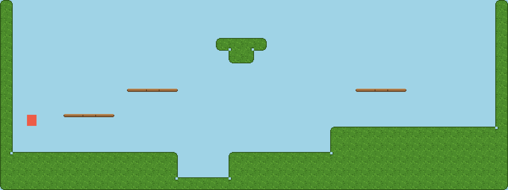

# Free side-view platformer starter — connecting ground tiles, one-way platforms you can drop through — Godot 4

Every other pack in this repo is top-down. This one is a **side-view platformer
that runs on F5**: 47-tile blob ground that connects itself, three one-way
platform tiles, and a player that walks, jumps, jumps up through platforms and
drops down through them. **MIT: use it in commercial games, no credit required.**
Needs Godot 4.3 or newer.

**[⬇ The whole pack in one zip](https://github.com/leobaray/blobsmith-autotile-wirer/releases/download/platformer-pack-v1/godot-platformer-starter-pack.zip)**
— the same bytes as the files below, with the licence inside it.

| file | what it is |
|---|---|
| `platformer_16px.png` + `.tres` | TileSet, 16px tiles, sheet 128×112 |
| `platformer_32px.png` + `.tres` | TileSet, 32px tiles, sheet 256×224 |
| `platformer_demo.tscn` | a painted 40×15 level, the player and a camera (uses the 16px TileSet) |
| `player.gd` | `CharacterBody2D` script: walk, jump, drop through platforms |
| `platformer_preview.png` | the picture above |
| `manifest.json` | the layout below, as data |

## Use it

1. Copy this whole folder anywhere into your project (every path in it is
   relative). Let the editor import the PNGs.
2. Open `platformer_demo.tscn` and press **F6** (run current scene), or set it
   as the main scene and press **F5**.

Or take only the TileSet: copy one size's `.png` and `.tres` into the same
folder, add a `TileMapLayer`, set its TileSet to the `.tres`, and in the TileMap
panel → **Terrains** → **Connect** paint **Ground**. Place platform tiles from
the **Tiles** tab. Add `player.gd` to your own `CharacterBody2D` and set its
`collision_mask` to 3.

**Controls** — only the built-in actions, so there is nothing to add to the
Input Map: ← → (`ui_left` / `ui_right`) walk, Space or Enter (`ui_accept`) jump,
**↓ + Space** (`ui_down` + `ui_accept`) on a platform drops through it.

## Layout

8×7 tiles.

- **Rows 0–5**: the 47 grass blob tiles, in the same order as the
  [starter pack](../starter-pack/) (slot 7,5 is empty). Terrain set 0, Match
  Corners and Sides, terrain `Ground`. A full-square collision polygon on
  **physics layer 0** (collision layer value 1).
- **Row 6**: `(0,6)` platform left end, `(1,6)` middle, `(2,6)` right end. A
  plank a quarter of a tile thick at the top of the tile, transparent below. No
  terrain. A collision polygon over the plank on **physics layer 1 only**
  (collision layer value 2), **One Way** on.

## Why the platforms are on their own physics layer

A one-way tile does not let a body fall through it because you press down: it
lets it through only once the body is already deeper into it than
`one_way_margin`. The fix that works is to put the platforms on a collision bit
the ground does not use, and clear that bit from the player's mask for a few
physics frames. Clearing it only for one frame is not enough, and with a single
shared bit the player would fall through the ground too. Measured in
[why you cannot drop through the one-way tile](../../docs/why-you-cannot-drop-through-the-one-way-tile.md).

`player.gd` does exactly that: `platform_bit` = 2, `drop_frames` = 6. With this
player's gravity, 3 frames leaves it standing on the platform and 4 drops it
(`P7` below). If you raise `one_way_margin`, lower `gravity` or make the plank
thicker, raise `drop_frames` too. Down + jump on solid ground is a normal jump.

## Verified, not asserted

`verify_platformer.sh /path/to/godot` builds a throwaway project with this
folder in it, loads the real scene and drives the real `player.gd` with real
physics frames and `Input.action_press` on the `ui_*` actions. Positions are
compared as whole pixels. On 2026-09-17: **22/22 checks on each of Godot 4.3,
4.4 and 4.7 stable**, with the same measured values on all three.

| id | claim |
|---|---|
| S1–S2 | the scene loads; Player has `player.gd` and `collision_mask` 3; Level has the TileSet |
| S3–S6 | for each size: loads with its PNG, 50 tiles; physics layers 0 and 1 on collision values 1 and 2; one terrain set, Match Corners and Sides, `Ground`; 47 ground tiles with a square polygon on layer 0 only, 3 platform tiles with no polygon on layer 0 and a one-way polygon over the plank on layer 1 |
| T1 | all 168 ground cells in the demo are Ground tiles |
| T2 | every touching pair of ground cells agrees on every shared side and corner, and every side bit is set exactly where ground is |
| T3 | control: one floor cell swapped for the island tile — the same audit finds 16 disagreements |
| P1 | the player spawned in the air falls and stands on the floor (`y` = 185, `is_on_floor()`) |
| P2 | jumping from under a platform rises past it, never touches a ceiling, and ends standing on it (`y` = 137) |
| P3 | ↓ + jump on the platform drops through and lands on the floor below — never lower than `y` = 185 — with the mask back to 3 |
| P4 | control: jump alone on the platform lands back on the platform |
| P5 | control: ↓ + jump on solid ground is a normal jump and lands back on the ground |
| P6 | control: with One Way switched off on the platform polygons, the same jump from below hits the plank (`is_on_ceiling()`) and comes back down to the floor |
| P7 | `drop_frames` 1, 2, 3 stay on the platform; 4, 5, 6 drop to the floor |
| W1 | the demo run as the main scene for 120 frames prints 0 `ERROR` lines |
| W2 | the verification run prints 0 `ERROR` lines |

`--invert` flips T2 and P3 on purpose: exit 1 on all three versions. A GDScript
parse error exits 3, not 0. What is **not** checked: pixels, and keyboard
input from a real window (the actions are pressed from script). 4.2 is not
covered (no `TileMapLayer`).

Procedural placeholder art, generated by `make-platformer-pack.js` in the
Blobsmith build repo from the same base block as the starter pack's grass. The
demo level's tiles were painted by Godot 4.3 with `set_cells_terrain_connect`,
not by hand.

## License

MIT — [`LICENSE`](../../LICENSE). The art, the `.tres`, the scene and the script.
