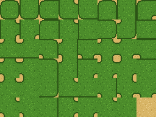
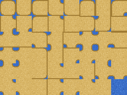
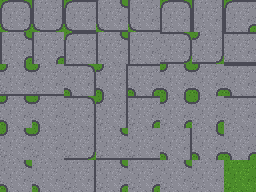
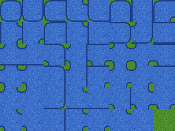
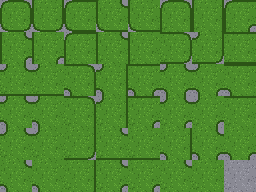
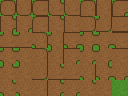
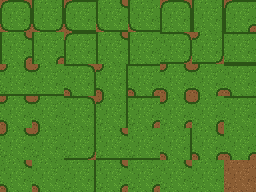

# Free terrain-transition TileSets — grass/sand, sand/water shoreline, stone/grass path, water/grass pond, grass/stone overgrown floor, dirt/grass road, grass/dirt tilled ground — Godot 4



The [starter pack](../starter-pack/) paints one terrain against **empty**. This
folder is the next question: **one terrain meeting another**, with no gap and no
seam between them. Seven pairs, each in 16px and 32px.
**MIT: use it in commercial games, no credit required.**

| file | meets | tile | sheet |
|---|---|---|---|
| `grass_on_sand_47blob_16px.png` + `.tres` | grass over sand | 16px | 128×96 |
| `grass_on_sand_47blob_32px.png` + `.tres` | grass over sand | 32px | 256×192 |
| `sand_on_water_47blob_16px.png` + `.tres` | sand over water (shoreline, islands) | 16px | 128×96 |
| `sand_on_water_47blob_32px.png` + `.tres` | sand over water (shoreline, islands) | 32px | 256×192 |
| `stone_on_grass_47blob_16px.png` + `.tres` | stone over grass (paths, plazas) | 16px | 128×96 |
| `stone_on_grass_47blob_32px.png` + `.tres` | stone over grass (paths, plazas) | 32px | 256×192 |
| `water_on_grass_47blob_16px.png` + `.tres` | water over grass (ponds, lakes, rivers) | 16px | 128×96 |
| `water_on_grass_47blob_32px.png` + `.tres` | water over grass (ponds, lakes, rivers) | 32px | 256×192 |
| `grass_on_stone_47blob_16px.png` + `.tres` | grass over stone (overgrown floors, ruins) | 16px | 128×96 |
| `grass_on_stone_47blob_32px.png` + `.tres` | grass over stone (overgrown floors, ruins) | 32px | 256×192 |
| `dirt_on_grass_47blob_16px.png` + `.tres` | dirt over grass (dirt roads, farm paths, clearings) | 16px | 128×96 |
| `dirt_on_grass_47blob_32px.png` + `.tres` | dirt over grass (dirt roads, farm paths, clearings) | 32px | 256×192 |
| `grass_on_dirt_47blob_16px.png` + `.tres` | grass over dirt (tilled fields, grass patches) | 16px | 128×96 |
| `grass_on_dirt_47blob_32px.png` + `.tres` | grass over dirt (tilled fields, grass patches) | 32px | 256×192 |

 
 
 

Every pair has the same shape: terrain 0 is the first name in the file (the
blob), terrain 1 is the second (the ground under it). Below, "Grass" and "Sand"
stand for those two — for the shoreline read Sand and Water, for the path Stone
and Grass, for the pond Water and Grass, for the overgrown floor Grass and Stone,
for the road Dirt and Grass, for the tilled ground Grass and Dirt.

## Use it (~20 seconds)

1. Copy **both** files of one size — the `.png` and the `.tres` — into the same
   folder of your project. Let the editor import the PNG.
2. Add a `TileMapLayer` and set its `TileSet` to the `.tres`.
3. TileMap panel → **Terrains** tab → **Connect** mode. Paint **Sand** over the
   area first, then paint **Grass** on top of it. Erase grass by painting Sand
   back over it.

From code, the same two strokes:

```gdscript
layer.set_cells_terrain_connect(area_cells, 0, 1)   # terrain set 0, terrain 1 = Sand
layer.set_cells_terrain_connect(grass_cells, 0, 0)  # terrain set 0, terrain 0 = Grass
```

## What is different from a one-terrain TileSet

- **One terrain set, two terrains in it**: terrain 0 `Grass`, terrain 1 `Sand`,
  mode Match Corners and Sides. Two *terrain sets* cannot connect to each other;
  two terrains in *one* set can. That is the whole trick.
- **Every peering bit is set on every tile, 8 per tile.** On a grass tile, a side
  or corner is `Grass` where grass continues and `Sand` everywhere else. A
  starter-pack tile leaves those bits unset, which means "empty" — so painting it
  over sand gives Godot no tile that agrees with the sand next to it.
- **48 tiles, 8×6**: the 47 grass blob tiles in the same order as the starter
  pack (each drawn over sand, so the sheet has no transparent pixel), plus one
  full sand tile in the last slot.
- A full-square collision polygon on every tile, physics layer 0, as in the
  starter pack. Delete the physics layer in the inspector if sand should be
  walkable.

To use your own art: keep the layout. Your grass sheet in the starter pack's
47-tile order, drawn over your sand, plus a full sand tile last, wires up
exactly like this `.tres`.

## Verified, not asserted

`verify_transitions.sh /path/to/godot` builds a throwaway project, imports all
fourteen PNGs and, for each TileSet, paints a 14×11 field of the under terrain with a
lake of the top one in it (straight edges, a one-cell peninsula, a one-cell
hole, a lone island, two blobs touching only at a corner). Grass/sand on
2026-09-14 (16/16); all seven pairs on 2026-09-15, **112/112 checks on each of
Godot 4.3, 4.4 and 4.7 stable**:

| id | claim |
|---|---|
| T1 | the `.tres` loads with the PNG next to it (relative path) |
| T2 | 48 tiles in one atlas |
| T3 | one terrain set, Match Corners and Sides, top terrain = 0 and under terrain = 1, named as in the file |
| T4 | 48/48 tiles carry a collision polygon |
| T5 | all 154 cells get a tile — none left empty |
| T6 | every pair of touching cells agrees on every shared side and corner (read from the engine's `TileData`: 0 disagreements) |
| T7 | every cell painted Grass is a Grass tile, every cell painted Sand is a Sand tile |
| T8 | control: the same sheet with its Sand bits erased at runtime (a one-terrain set) is **not** clean — 188 disagreeing sides/corners on the same paint, identical on all three builds |

T6 was also run inverted (`LG_SELFTEST=1`): exit 1 with exactly the fourteen T6
FAILs (one per TileSet), so the check can fail. What is **not** checked: pixels. "Agrees" is the
engine's terrain data; that the art lines up at those edges is what the
sheet above shows, not an assertion. 4.2 is not covered (no `TileMapLayer`).

Procedural placeholder art, generated by `make-transition-pack.js` in the
Blobsmith build repo from the same base blocks as the starter pack (dirt is the
grass block with its four colours swapped).

## License

MIT — [`LICENSE`](../../LICENSE). Both the art and the `.tres` files.
