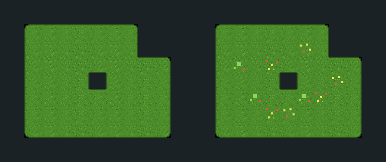

# Free tile-variants pack (random variation, Match Sides) — Godot 4

Eight ready-to-paint **Match Sides** TileSets that do not look tiled.
**MIT: use them in commercial games, no credit required.** Every other free pack
in this repo answers *which tile goes where*; this one answers the complaint that
arrives five minutes later — **a painted field is the same interior tile repeated
until you can see the grid**.

Godot 4 already fixes that and almost nobody uses it: **several atlas tiles may
declare the identical set of terrain peering bits**, and
`set_cells_terrain_connect` then picks among them at random, **weighted by each
tile's `probability`**. These tilesets ship that wiring done.

*Both panels are the SAME `.tres`, painted by Godot with the same call. The only
difference is the `probability` of three tiles. The preview script blitted only
the tiles the engine chose.*

| terrain | 16px | 32px | tiles | collision |
|---|---|---|---|---|
| Grass | `grass_variants_16px` | `grass_variants_32px` | 19 | none |
| Stone | `stone_variants_16px` | `stone_variants_32px` | 19 | none |
| Sand  | `sand_variants_16px`  | `sand_variants_32px`  | 19 | none |
| Water | `water_variants_16px` | `water_variants_32px` | 19 | none |

19 tiles = the **16 Match Sides masks** (every combination of the four sides) plus
**3 extra copies of the interior tile**, decorated with pebbles, flowers, cracks
or ripples. Sheets are 8×3 cells: 128×48 for 16px, 256×96 for 32px.

## Use it (3 steps, ~20 seconds)

1. Copy **both** files of one entry — the `.png` **and** the `.tres` — into your
   project, any folder. They must land in the *same* folder: the `.tres` points
   at the PNG by filename, on purpose, so the pair works wherever you put it.
2. Let the editor import the PNG (it does this by itself when the Godot window
   regains focus). Don't copy any `.import` file from here — Godot writes its own.
3. Set a `TileMapLayer`'s `TileSet` to the `.tres`, open the **TileMap** panel →
   **Terrains** tab and paint. The variation happens while you paint; there is
   nothing to call at runtime and no plugin to install.

## The mechanism, measured

Measured on Godot **4.3, 4.4 and 4.7**, on all eight tilesets, by
`verify_variants_pack.sh` (16 claims per tileset, 128 in total):

**1. Four tiles, one meaning.** The four interior tiles each declare all four side
peering bits, so as far as the terrain solver is concerned they are
interchangeable. Nothing else in the tileset is duplicated.

**2. The weights decide the mix.** The plain tile has `probability = 1.0` and each
decorated one `0.35`, so the plain one should take 1 / 2.05 = **48.8%** of a field.
Painting a 24×24 square and counting the 400 cells away from the border gives
**45–55%**, run to run (the draw is random; the gate allows ±12 points) — and all
four tiles turn up in a single square.

**3. `probability` is the knob, not a suggestion.** Set the three decorated tiles
to `probability = 0` and the same call paints **one distinct tile** over the whole
field. That is what the left panel of the picture above is.

**4. `set_cell` never consults it.** Ask for the tile whose probability is 0 and
that is exactly what gets stored. `probability` steers the *terrain solver*; it is
not a global dice roll over your tilemap.

## Making your own variants from these

The recipe is three lines of atlas editing, no code:

1. In the TileSet editor, **Setup** tab, add a tile over an unused region of your
   atlas that holds a second drawing of your interior tile.
2. In **Select** mode, give it the **same peering bits** as the interior tile you
   already have (all four sides, for a Match Sides set).
3. Set its **Probability** (Select mode → Rendering/Misc) to how often you want
   it, relative to the others. A weight of `0.35` against a plain `1.0` means it
   shows up on about one cell in six; `0.2` would make it one in eight.

Two rules learned the hard way, and enforced by the build of this pack:

- **Keep the outer ring of pixels identical to the plain tile.** A variant is
  interchangeable only if it meets its neighbours the way the plain one does;
  decoration that reaches the tile border creates a seam that appears at random.
  Every decorated tile here is inset by 2px (4px at 32) and the generator refuses
  to write a variant whose border pixels differ.
- **Variation is not the same as a scattered detail layer.** If the detail needs
  to move, animate or be queried (a flower a player can pick), it is a scene tile
  or a second `TileMapLayer`, not a variant — a variant has no identity: repaint
  the cell and you may get a different one.

## What is in the box

- `*_variants_16px.png` / `.tres`, `*_variants_32px.png` / `.tres` — the 8 tilesets
- `manifest.json` — what each tileset is, including which atlas coordinates are the
  interchangeable interior tiles and what weights they carry
- `variants_preview.png` — the picture above
- `verify_variants_pack.gd` / `.sh` — the engine gate that measures every claim on
  this page; run it against your own Godot binary:
  `./verify_variants_pack.sh /path/to/godot` (add `--invert` and it must exit 1)
- `LICENSE.txt` — MIT

Built by [Blobsmith](https://blobsmith.itch.io/blobsmith-lite), which turns 6 hand-drawn
tiles into a wired Godot 4 TileSet. The pack, the generator and the gate are MIT.
